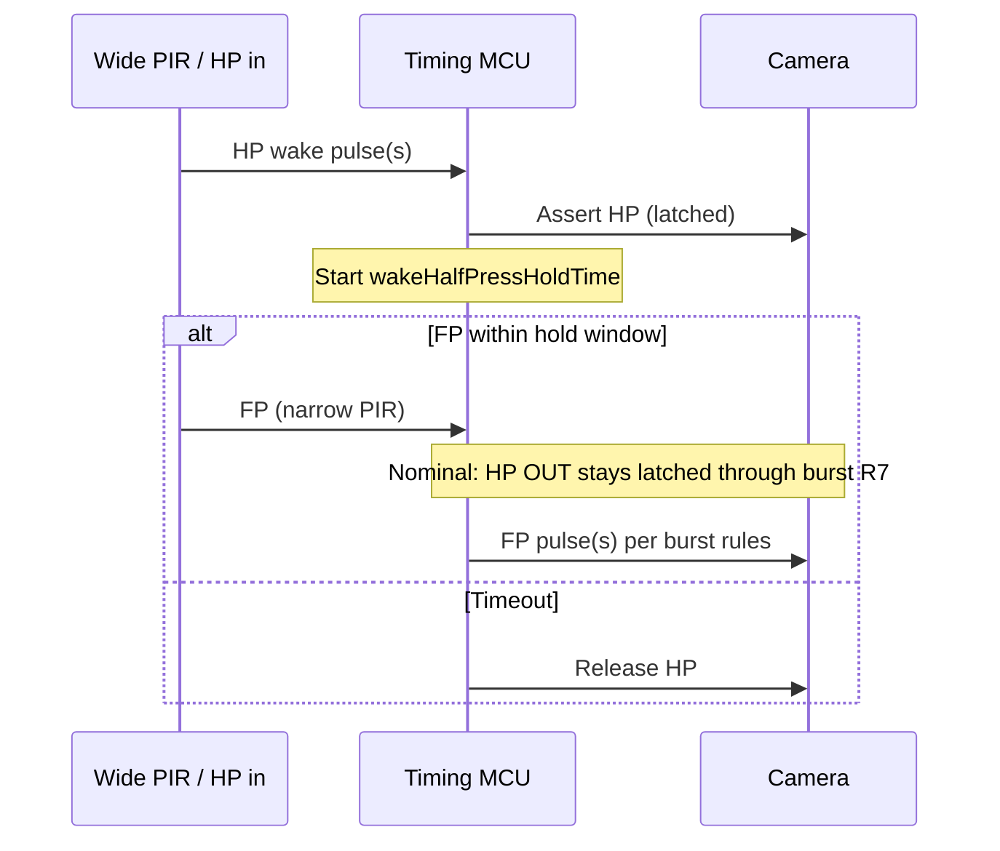

# Behavior specification

Normative description of what the timing MCU must do. Parameter names refer to [parameters.md](parameters.md). **Acceptance scenarios:** [scenarios.md](scenarios.md). Diagrams: [mcu-state-flow.md](diagrams/mcu-state-flow.md), [timing-sequences.md](diagrams/timing-sequences.md).

## Scenario index

| ID | Summary |
|----|---------|
| [SC-01](scenarios.md#sc-01--normal-wake-then-shoot) | Normal wake → FP → full burst → sleep |
| [SC-02](scenarios.md#sc-02--fp-during-sequence-ignored) | FP during `fullPressIgnoreGap` discarded |
| [SC-03](scenarios.md#sc-03--fp-flood-during-burst-ignored) | Repeated FP during burst; schedule unchanged |
| [SC-04](scenarios.md#sc-04--wake-timeout-no-fp) | HP only, timeout release |
| [SC-05](scenarios.md#sc-05--back-to-back-sequence) | New sequence same activity; AF + timing gates |
| [SC-06](scenarios.md#sc-06--cold-fp-no-prior-wake) | FP without prior HP |
| [SC-07](scenarios.md#sc-07--hp-during-active-burst) | HP ignored during burst |
| [SC-08](scenarios.md#sc-08--fp-before-hp) | FP before HP (proposed) |
| [SC-12](scenarios.md#sc-12--hp-only-pir-gap-minimum) | HP only, PIR Gap minimum |
| [SC-13](scenarios.md#sc-13--input-line-bounce-debounce) | Input line bounce (debounce) |
| [SC-14](scenarios.md#sc-14--held-vs-pulsed-fp-input) | Held vs pulsed FP |
| [SC-15](scenarios.md#sc-15--power-save-performance-budget) | Power-save performance (&lt; 1 ms) |

## Terminology

| Term | Meaning |
|------|---------|
| **Activity** | One continuous “session” from first camera HP assert (wake or cold FP) until HP is released and the trap returns to idle. May include **multiple sequences**. |
| **Sequence** | One **full-press activation cycle**: a debounced FP **input** is accepted → MCU runs `FrameCount` shutter pulses → sequence completes with `PostShutterHalfPressHoldTimeExtension`. Retriggers during a shot are **not** a new sequence (R10). |
| **Frame** | A single FP **output** pulse to the camera within a sequence. |

`MaxSequenceCount` limits how many sequences may run **per activity**, not how many frames per sequence (`FrameCount` does that).

Each accepted sequence typically **extends** how long camera HP stays valid: the full-press cycle runs longer than a wake-only timeout, so `wakeHalfPressHoldTime` is refreshed while activity continues (R13, R15). Total activity length is **not** capped by a global seconds limit — it is bounded by `MaxSequenceCount` and per-sequence timing (`FrameCount`, `StartFrameSpacingMin`, `PostShutterHalfPressHoldTimeExtension`).

## Activity (wake-to-sleep)

An **activity** begins when the MCU first asserts camera HP for a wake or cold FP path, and ends when:

- HP is released after the last sequence’s post-burst hold (and no further sequence is started), **and**
- `wakeHalfPressHoldTime` expires with no new wake/accepted FP, per policy — applies to wake-without-shoot timeout only, not a maximum activity duration.

`MaxSequenceCount` applies **per activity**. Extra FP inputs within `fullPressIgnoreGap` after each sequence start are ignored (R10). PIR **Gap** is set to **minimum** ([pir-sensor-settings.md](pir-sensor-settings.md)); MCU `fullPressIgnoreGap` handles burst retrigger.

## Core rules

| # | Rule |
|----|--------------------------------------------------------|
| R1 | HP **input** is wake/prepare only; MCU **latches camera HP ON** on wake and refreshes hold timer on repeated wake pulses per `wakeHoldRefreshPolicy` (default `extend`). |
| R2 | If no FP arrives before `wakeHalfPressHoldTime` expires, MCU **releases camera HP**. |
| R3 | FP may arrive **without** prior HP input. |
| R4 | Before **each** FP **output** pulse (every shutter activation), camera HP must have been active for at least `minHalfPressBeforeShutter`. If not, assert HP and wait the remainder before that pulse. |
| R5 | Each FP pulse to the camera lasts `shutterPulseDuration` (no overlapping FP outputs). |
| R6 | In a sequence, schedule successive FP **output** pulse **starts** at least `StartFrameSpacingMin` apart (rising edge to rising edge). Spacing is **start-to-start** and does **not** include `shutterPulseDuration`; actual interval may be longer if R4 or HP release delays the next start. |
| R7 | During a sequence burst, **keep camera HP OUT asserted** between frames; do not release HP because of trigger activations (original §4b). |
| R9 | During burst, **do not drop HP** merely because another FP input arrives (HP latch is independent of ignored FP). |
| R10 | From **sequence start** (accepted FP that schedules the burst), ignore all FP **inputs** for `fullPressIgnoreGap` — no second sequence, no counter changes, no extra frames in that window. Covers PIR retrigger flood when PIR **Gap = minimum**. Set **≥** typical burst length; default estimate `(FrameCount - 1) × StartFrameSpacingMin + shutterPulseDuration`. |
| R10b | An FP **input** is accepted and **starts a new sequence** only when the burst schedule is not in progress, `fullPressIgnoreGap` has elapsed since that sequence’s start, `sequencesStartedThisActivity < MaxSequenceCount`, and R4/R12 gates pass. |
| R11 | After the last frame of a sequence’s burst schedule, hold HP for `PostShutterHalfPressHoldTimeExtension`. If another sequence may still start (under `MaxSequenceCount`), HP may remain latched; release HP only when activity ends. |
| R12 | A new **sequence** begins when an FP is accepted after the prior sequence’s burst **schedule** is complete, within the same activity, until `MaxSequenceCount` is reached. R4 applies before the first FP output of that sequence. |
| R13 | While activity is active (any sequence in progress, between sequences, or post-burst with sequences remaining), camera HP must not be released solely because `wakeHalfPressHoldTime` expired (`activityHalfPressHoldPolicy = holdUntilActivityEnd`). |
| R14 | HP **input** during an active burst does not change `remainingFrames`, does not emit FP, and does not release camera HP (`halfPressDuringBurstPolicy = independent`). |
| R15 | Each **accepted sequence** **extends** remaining `wakeHalfPressHoldTime` from FP accept so the wake hold does not expire mid-activity while sequences continue. |

## Half-press without full-press (timeout path)



## Full-press without adequate half-press lead

| Condition | Behavior |
|-----------|----------|
| Before each shutter, HP active ≥ `minHalfPressBeforeShutter` | Fire that pulse after debounce |
| Before a shutter, HP inactive or lead too short | Assert HP, wait remainder of `minHalfPressBeforeShutter`, then fire that pulse |
| `fullPressWithoutPriorHpPolicy` | `assertHpThenWait` (see parameters) |

## Burst scheduling and FP ignore gap

**Start sequence:** A debounced FP **input** accepted while idle (first sequence) or after the prior sequence’s burst is complete sets `remainingFrames = FrameCount` for **that sequence only**, if `sequencesStartedThisActivity < MaxSequenceCount`. That schedule runs to completion; frame count is not capped by `MaxSequenceCount` (only sequence **count** is).

**FP ignore during sequence (R10):** Set PIR **Gap** to **minimum** (0.5 s). The MCU ignores FP **inputs** for `fullPressIgnoreGap` after each sequence start — not a per-pulse gap after each shutter.

**Default estimate** for `fullPressIgnoreGap` (tunable — set longer in the field if needed):

```text
(FrameCount - 1) × StartFrameSpacingMin + shutterPulseDuration
```

Example: `FrameCount = 4`, `StartFrameSpacingMin = 1.0 s`, `shutterPulseDuration = 0.1 s` → default **3.1 s**. With `shutterPulseDuration = 0.2 s` → **3.2 s**. Increase if `minHalfPressBeforeShutter` or other gates stretch real burst spacing beyond this estimate.

**Example** (`FrameCount = 4`):

| Step | Event | Result |
|--|----------|----------|
| 1 | First FP accepted | Sequence starts; ignore all further FP (R10) |
| 2 | More FP during frames 1–4 | **Ignored** (`fullPressIgnoreGap`) |
| 3 | Frames 1–4 | Fire on `StartFrameSpacingMin` schedule |
| 4 | Burst schedule complete | Post-burst hold (R11); R10 ignore ends when `fullPressIgnoreGap` elapses |
| 5 | New FP after sequence done | May start next sequence (R12) if `< MaxSequenceCount` |

**Between sequences:** Only after burst schedule completes may an FP start the next sequence (R12).

## Burst frame scheduling (within one sequence)

Normative timing for firmware — avoids reading `minHalfPressBeforeShutter` as an extra delay on top of `StartFrameSpacingMin`.

### Normal case (HP latched for whole sequence)

This matches the original spec: half press stays up; **N** frames every **Y** seconds.

1. Sequence starts → camera HP OUT **on** (wake path or cold-FP path).
2. **Sequence start:** Begin R10 FP ignore for `fullPressIgnoreGap` (default ≈ `(FrameCount - 1) × StartFrameSpacingMin + shutterPulseDuration`).
3. **Frame 1:** Wait until `minHalfPressBeforeShutter` satisfied → FP OUT pulse (`shutterPulseDuration`).
4. **Frames 2…N:** At each scheduled time `t_prev + StartFrameSpacingMin`, fire the next FP OUT pulse (R6). **Do not** wait another full `minHalfPressBeforeShutter` if HP never dropped — R4 is already satisfied.
5. **Sequence end:** After frame **N** → `PostShutterHalfPressHoldTimeExtension` (R11). R10 ignore ends when `fullPressIgnoreGap` elapses (burst may finish earlier).

Example (`minHalfPressBeforeShutter` = 0.5 s, `StartFrameSpacingMin` = 1.0 s, `FrameCount` = 4, HP held throughout):

| Event | Time (illustrative) |
|-------|---------------------|
| HP asserted | 0.0 s |
| Frame 1 OUT | 0.5 s (after T) |
| Frame 2 OUT | 1.5 s |
| Frame 3 OUT | 2.5 s |
| Frame 4 OUT | 3.5 s |

`StartFrameSpacingMin` sets the schedule. **`minHalfPressBeforeShutter` does not override or replace `StartFrameSpacingMin`** in this case.

### Exception path (HP released mid-burst)

Not normal operation. If camera HP OUT was released between scheduled frames, **before** the next FP OUT pulse:

1. Assert HP OUT.
2. Wait until `minHalfPressBeforeShutter` has elapsed since that assert.
3. Then fire the pulse.

The **actual** gap since the previous frame may be **longer than** `StartFrameSpacingMin`; that is a late gate, not a change to **Y**.

### What does *not* happen

- No separate focus-acquisition interval between frames.
- `minHalfPressBeforeShutter` is **not** added to every inter-frame interval when HP stays latched.
- `StartFrameSpacingMin` is **not** shortened or replaced by **T** when HP lead is already satisfied.

## Policies (enums)

| Parameter | Intended value | Meaning |
|-----------|----------------|---------|
| `halfPressDuringBurstPolicy` | `independent` | HP input during burst does not cancel latched HP |
| `fullPressWithoutPriorHpPolicy` | `assertHpThenWait` | Cold FP path waits for `minHalfPressBeforeShutter` before each pulse |

## Customer-facing summary

1. **Motion detected (wide area):** camera wakes and autofocuses; if nothing worth a photo appears within the configured hold time, the camera goes back to sleep.
2. **Subject in frame (narrow area):** camera takes a configured number of photos per trigger event, spaced by `StartFrameSpacingMin`.
3. **Retriggers during a sequence:** extra full-press signals for `fullPressIgnoreGap` after sequence start are **ignored** (PIR Gap minimum; MCU R10) so the burst is not reset or extended.
4. **Another pass after a sequence:** a new full-press after the prior sequence’s burst completes can start another sequence in the same activity (subject to AF timing and `MaxSequenceCount`).

## Sequence boundaries (SC-05, SC-05b)

**Sequence ends when:** that sequence’s burst schedule is complete and its `PostShutterHalfPressHoldTimeExtension` has run (unless cut short by accepting the next sequence).

**Activity ends when:** no further sequence will start (`MaxSequenceCount` reached or no more FP), wake hold expired, and HP released.

**New sequence on FP:** After the prior sequence’s burst schedule is complete, a debounced FP may start the next sequence in the **same activity** (R12), incrementing `sequencesStartedThisActivity`, until `MaxSequenceCount`.

**Gates before first FP output of a new sequence:**

1. **Prior sequence complete (R12):** Burst schedule finished and `fullPressIgnoreGap` elapsed since that sequence’s start.
2. **AF lead (R4):** `minHalfPressBeforeShutter` (often already satisfied if HP stayed latched).
3. **Spacing:** `PostShutterHalfPressHoldTimeExtension` from prior sequence may still run before next sequence’s first shot.

Flash/strobe readiness is **not** an MCU parameter — spacing is enforced via `StartFrameSpacingMin` and operator flash setup.

**FP during post-shutter HP hold extension:** See [SC-05b](scenarios.md#sc-05b--fp-during-post-shutter-hp-hold-extension).

## Developer notes

- Treat the MCU lane as a **state machine**, not a linear script — HP latch, per-sequence burst scheduler, and `sequencesStartedThisActivity` interact.
- Debounce HP and FP inputs separately (`halfPressInputDebounce`, `fullPressInputDebounce`).
- `triggerDuringBurstPolicy` **removed** — sequence-level FP ignore (R10) when PIR Gap = minimum.
- `minStrobeRecycleTime` **removed** — flash timing is not an MCU parameter; use `StartFrameSpacingMin` and external setup.
- `triggerRetriggerPolicy` removed — covered by SC-01, SC-05, SC-06 and R12.
- Align firmware constant names with [parameters.md](parameters.md); validate against [scenarios.md](scenarios.md).
