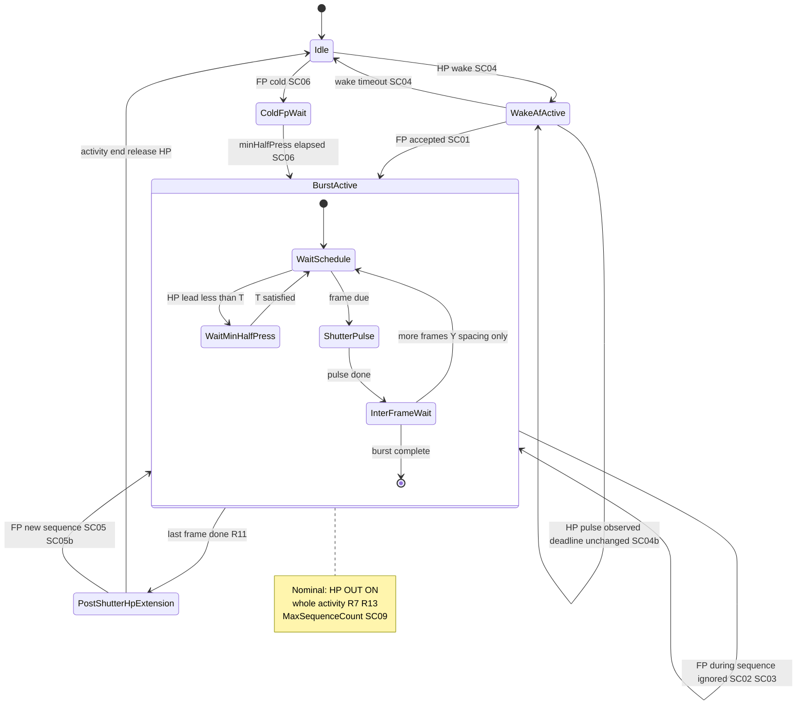
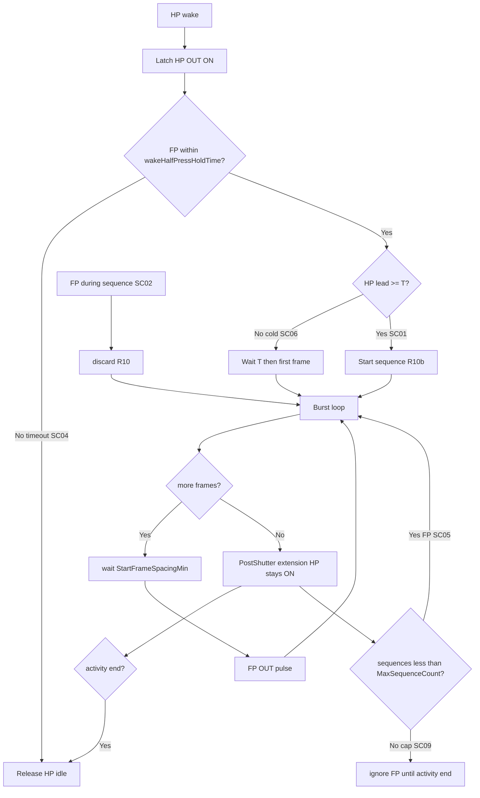

# MCU state flow

State-oriented view. Parameters: [parameters.md](../parameters.md). Rules: [behavior-spec.md](../behavior-spec.md). Scenarios: [scenarios.md](../scenarios.md).

**Nominal path (defaults):** [timing-sequences § Nominal](timing-sequences.md#nominal-path-defaults) — camera **HP OUT stays ON** from activity start through burst(s) and `PostShutterHalfPressHoldTimeExtension` until activity ends (R7, R13).

## Activity state diagram

**Burst substates (nominal):** After frame 1, `WaitSchedule` waits **StartFrameSpacingMin** only — not another full `minHalfPressBeforeShutter` unless HP was released (`WaitMinHalfPress`).

## Decision flow (nominal path highlighted)

## States (customer language)

| State | Scenario | Experience |
|-------|----------|------------|
| **Nominal activity (SC-01)** | SC-01 | HP stays on; burst after FP; extension; sleep |
| Idle | — | Camera ready |
| Wake / AF active | SC-04, SC-01 wake phase | Focusing after distant motion |
| Burst active | SC-01–SC-03 | Exposures firing; extra FP inputs ignored (R10) |
| Post-shutter HP extension | SC-01, SC-05b | HP still on after last frame (`PostShutterHalfPressHoldTimeExtension`) |
| Second sequence same activity | SC-05, SC-05b | HP usually still latched; new burst |
| At max sequences | SC-09 | Further FP cannot start sequences until activity ends |

## Exception entry points

| From | Event | To |
|------|-------|-----|
| Idle / wake | No FP before X expires | Idle (SC-04) |
| Idle | FP without prior HP | ColdFpWait → BurstActive (SC-06) |
| BurstActive | HP OUT released mid-burst | WaitMinHalfPress before next frame (behavior-spec exception) |
