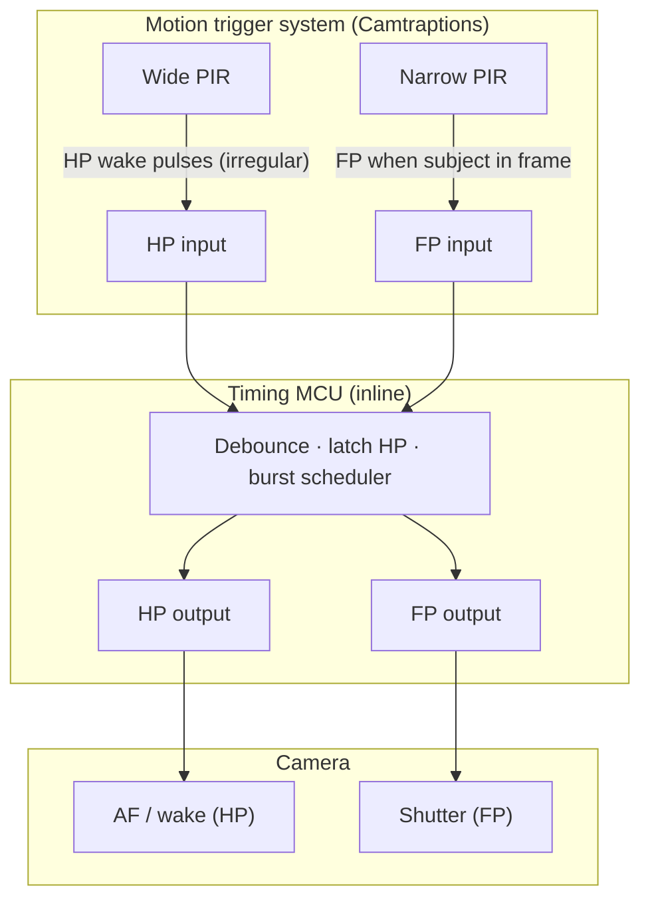

# System swim lane

Cross-functional view: who emits signals vs who enforces timing. For MCU logic detail see [mcu-state-flow.md](mcu-state-flow.md). Acceptance cases: [scenarios.md](../scenarios.md).

Under **default parameters**, the MCU keeps **camera HP OUT asserted (latched)** for the whole activity—from wake (or cold FP) through all frames and `PostShutterHalfPressHoldTimeExtension`—not toggled per shutter pulse. See [timing-sequences § Nominal](timing-sequences.md#nominal-path-defaults).

## Responsibility matrix

| Step | Motion trigger | Timing MCU | Camera |
|------|----------------|------------|--------|
| Detect motion in wide FOV | Emits HP pulses | Debounce; latch HP out | Enters AF / wake |
| Detect subject in narrow FOV | Emits FP | Schedule shutter + burst | Exposes shutter on FP |
| Hold HP between frames and sequences | — | Latch HP OUT per R7/R13 (nominal); release on activity end | AF active while HP asserted |
| Burst / multi-frame | May emit more FP | Generates FP pulse train | Single-shot + external pulses |
| End of event | — | Release HP after timeouts | Returns to idle |

## Non-goals on this diagram

- Frame Wrangler, NAS, or other studio software (unrelated systems mentioned in the ChatGPT preamble).
- Camtraptions PIR v4 menu setup — see [pir-sensor-settings.md](../pir-sensor-settings.md).
