# Timing sequence examples

Waveform-style views cross-linked to [scenarios.md](../scenarios.md). Use [parameters.md](../parameters.md) for configured values.

**Read this first:** [Nominal path (defaults)](#nominal-path-defaults) — HP OUT latched for the whole activity; exceptions are labeled below.

| Section | Scenario |
|---|--------------|
| **Nominal** | [SC-01](#nominal-path-defaults) — default happy path |
| A | [SC-04](../scenarios.md#sc-04--wake-timeout-no-fp) Wake timeout *(exception)* |
| B | [SC-06](../scenarios.md#sc-06--cold-fp-no-prior-wake) Cold FP *(exception)* |
| C | [SC-01](../scenarios.md#sc-01--normal-wake-then-shoot) Same as nominal (detail) |
| D | [SC-02](../scenarios.md#sc-02--fp-during-sequence-ignored) / [SC-03](../scenarios.md#sc-03--fp-flood-during-burst-ignored) FP ignored (R10) |
| E | [Burst scheduling](../behavior-spec.md#burst-frame-scheduling-within-one-sequence) StartFrameSpacingMin vs T |
| F | [SC-05](../scenarios.md#sc-05--back-to-back-sequence) Back-to-back sequence |
| G | [SC-07](../scenarios.md#sc-07--hp-during-active-burst) HP during burst *(exception input)* |
| H | [SC-16](../scenarios.md#sc-16--hp-input-released-immediately-after-fp) HP input release after FP |
| I | [SC-17](../scenarios.md#sc-17--first-frame-gated-by-short-hp-lead) / [SC-20](../scenarios.md#sc-20--t-greater-than-y-interaction) Short HP lead and T vs Y |

## Nominal path (defaults)

**This is the intended field behavior** with default parameters and `activityHalfPressHoldPolicy = holdUntilActivityEnd` (R7, R13).

| Parameter | Default | Role in this diagram |
|-----------------|------|----------------------|
| `minHalfPressBeforeShutter` (T) | 0.5 s | Gates frame 1 only if HP lead too short |
| `StartFrameSpacingMin` (Y) | 1.0 s | Min start-to-start between frames 2…N |
| `FrameCount` (N) | 4 | Shutter pulses per sequence |
| `PostShutterHalfPressHoldTimeExtension` (Z) | 2.0 s | HP hold after last frame |
| `shutterPulseDuration` | 100 ms | FP OUT pulse width |
| `wakeHalfPressHoldTime` (X) | 10 s | Wake-only timeout (extended by R15 during shoot) |

**SC-01 timeline:** HP wake t=0, FP accepted t=1.0 s (HP lead already ≥ T). **Camera HP OUT goes ON once** and stays latched through burst + Z. **No** extra T-wait between frames 2…N.

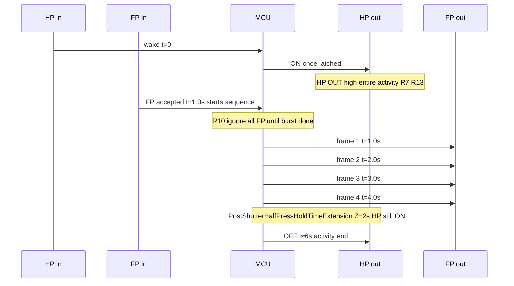

**Camera outputs (SC-01 defaults)**

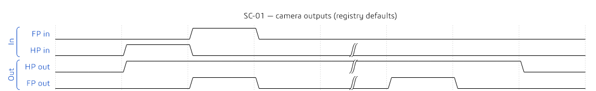{ width=6.5in }

| Event | Time (s) |
|-------|----------|
| HP wake (HP OUT ON) | 0.0 |
| FP accepted (sequence start) | 1.0 |
| Frame 1 FP OUT start | 1.0 |
| Frame 2 FP OUT start | 2.0 |
| Frame 3 FP OUT start | 3.0 |
| Frame 4 FP OUT start | 4.0 |
| HP OUT OFF (after Z) | ~6.0 |

Exception paths: [A wake timeout](#a--sc-04-wake-only-then-timeout), [B cold FP](#b--sc-06-fp-without-prior-wake-cold-start), [G HP input during burst](#g--sc-07-hp-during-burst-no-effect-on-schedule), [H HP input release after FP](#h--sc-16-hp-input-release-after-fp), [I short HP lead](#i--sc-17sc-20-short-hp-lead-and-t-vs-y), mid-burst HP OUT release in [behavior-spec](../behavior-spec.md#exception-path-hp-out-released-mid-burst).

---

## A — SC-04: Wake only, then timeout

*Exception — not the nominal shoot path.*

**Camera outputs (SC-04)**

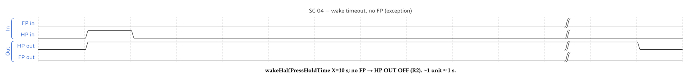{ width=6.5in }

| Event | Time (s) |
|-------|----------|
| HP wake (HP OUT ON) | 0.0 |
| No FP | — |
| HP OUT OFF (`wakeHalfPressHoldTime` X=10) | ~10.0 |

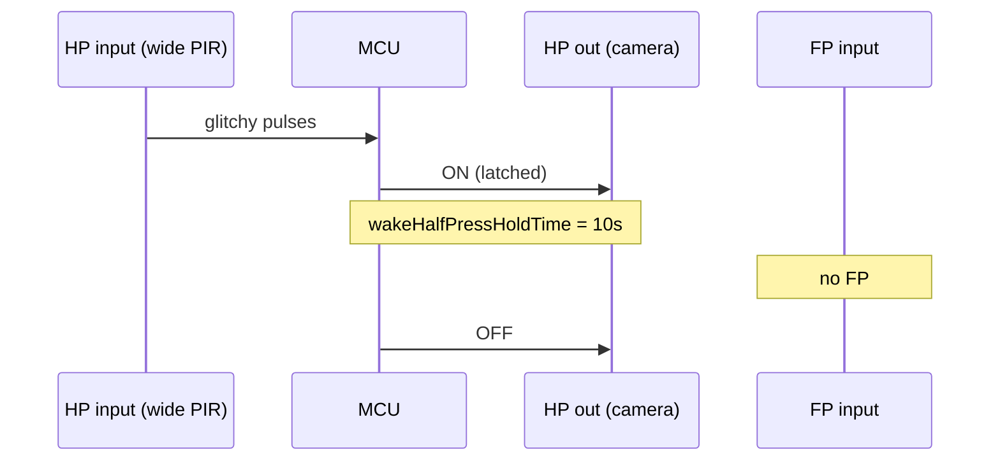

## B — SC-06: FP without prior wake (cold start)

*Exception — FP before any HP wake.*

**Camera outputs (SC-06)**

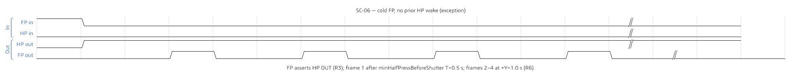{ width=6.5in }

| Event | Time (s) |
|-------|----------|
| FP in (cold) | 0.0 |
| HP OUT ON (R3) | 0.0 |
| Frame 1 FP OUT start | 0.5 (after T) |
| Frame 2 FP OUT start | 1.5 |
| Frame 3 FP OUT start | 2.5 |
| Frame 4 FP OUT start | 3.5 |
| HP OUT OFF (after Z) | ~5.5 |

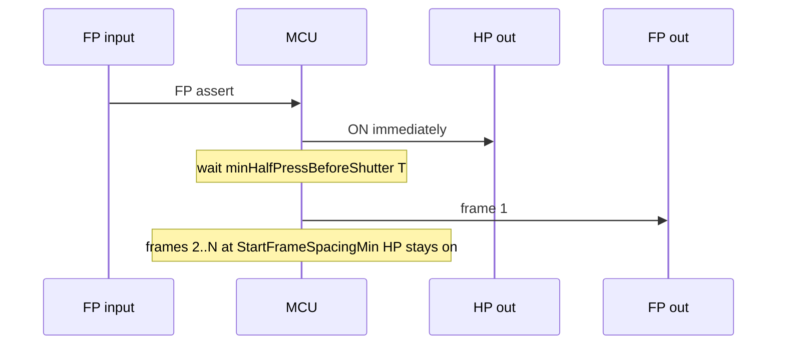

## C — SC-01: Wake then FP at 1 s

Same as [Nominal path](#nominal-path-defaults). Canonical reference for acceptance tests.

## D — SC-02 / SC-03: FP ignored during sequence (R10)

*Overlay on nominal burst — PIR Gap minimum.*

MCU ignores **all** FP **inputs** from sequence start until the burst **schedule** completes (R10). `fullPressIgnoreGap` is a timing budget, not a per-retrigger window after each pulse.

**Camera outputs (SC-02)**

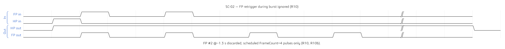{ width=6.5in }

**Camera outputs (SC-03)**

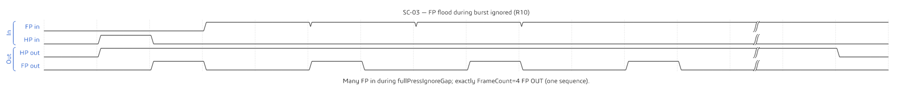{ width=6.5in }

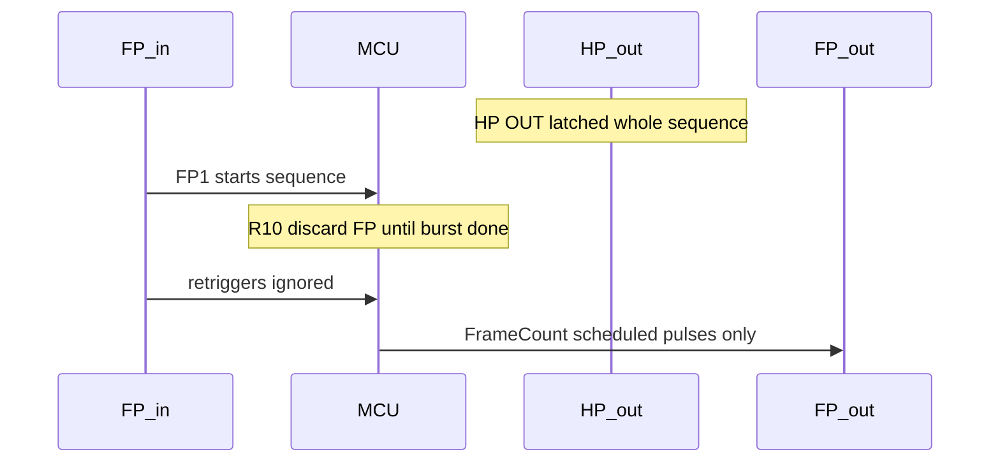

SC-03: many FP inputs during burst → still only `FrameCount` frames — see [scenarios.md](../scenarios.md#sc-03--fp-flood-during-burst-ignored).

## E — Burst schedule: StartFrameSpacingMin (min) vs minHalfPressBeforeShutter

*Nominal spacing when HP never drops — teaching example from behavior-spec (sequence start at HP assert).*

| Event | Time |
|-------|------|
| HP asserted | 0.0 s |
| Frame 1 OUT | 0.5 s (after T) |
| Frame 2 OUT | 1.5 s |
| Frame 3 OUT | 2.5 s |
| Frame 4 OUT | 3.5 s |

Frames 2…N use **Y only** — no second T-wait. See [behavior-spec](../behavior-spec.md#burst-frame-scheduling-within-one-sequence).

**Camera outputs (SC-11)**

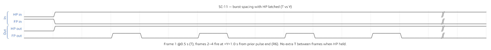{ width=6.5in }

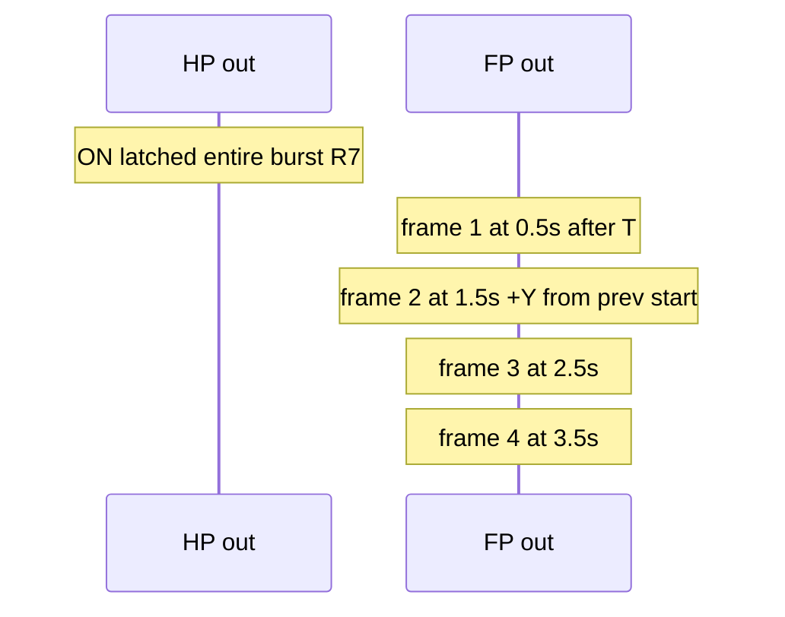

## F — SC-05: Back-to-back sequence

*Nominal multi-sequence — HP OUT stays latched across both sequences (R13).*

**Camera outputs (SC-05)**

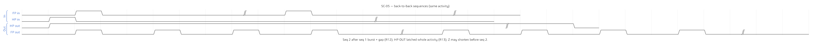{ width=6.5in }

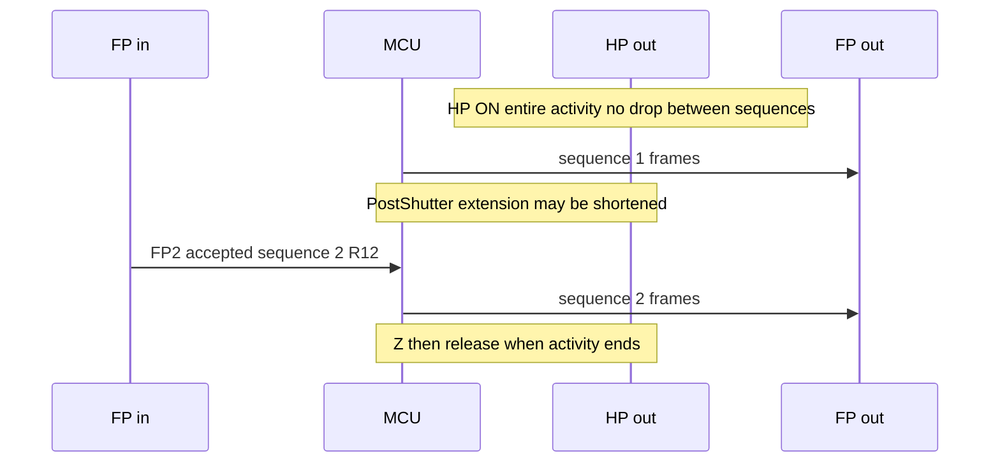

## G — SC-07: HP during burst (no effect on schedule)

*Exception input — wide PIR glitches during burst; schedule unchanged (R14).*

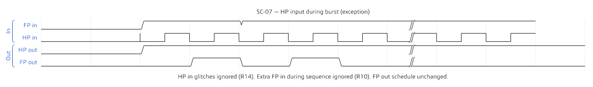{ width=6.5in }

HP **input** does not reset `remainingFrames` or add frames (**R14**). Camera HP **output** stays latched (**R7**). Extra FP **input** during the sequence is ignored (**R10**); only the scheduled `FrameCount` FP OUT pulses fire.

## H — SC-16: HP input release after FP

*Exception input — trigger HP input is short, but camera HP OUT remains latched by the MCU.*

{ width=6.5in }

HP **input** may release before or immediately after FP input. In state-machine mode, that release is not mirrored to camera HP OUT. The MCU keeps HP OUT latched through the burst and `PostShutterHalfPressHoldTimeExtension`; if the HP lead is short, frame 1 waits for `minHalfPressBeforeShutter`.

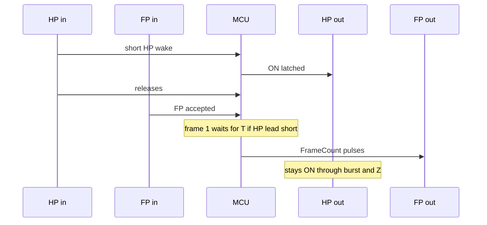

## I — SC-17/SC-20: Short HP lead and T vs Y

*Timing interaction — T may delay frame 1, but it is not added between later frames while HP OUT is latched.*

{ width=6.5in }

The first frame starts at:

```text
max(FP accept time, HP OUT assert time + minHalfPressBeforeShutter)
```

After frame 1, `StartFrameSpacingMin` controls the burst cadence as long as HP OUT remains latched. Even when `minHalfPressBeforeShutter > StartFrameSpacingMin` (SC-20), T must not be applied again before frames 2..N.
