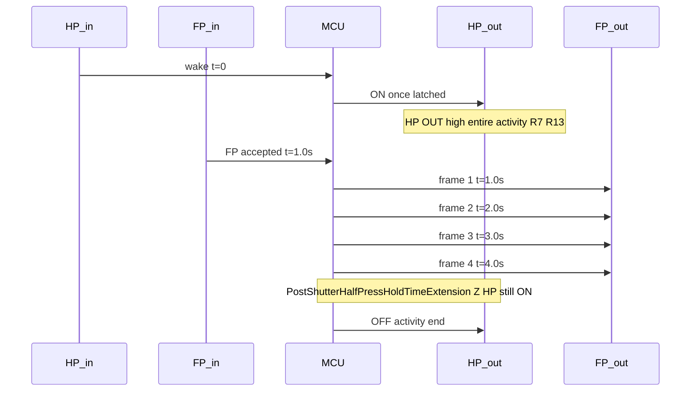
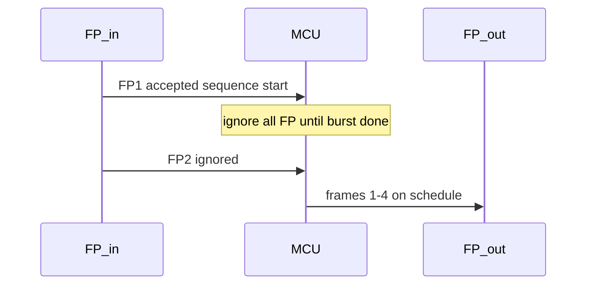
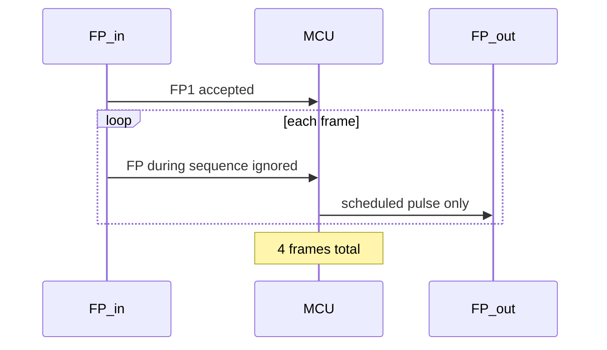
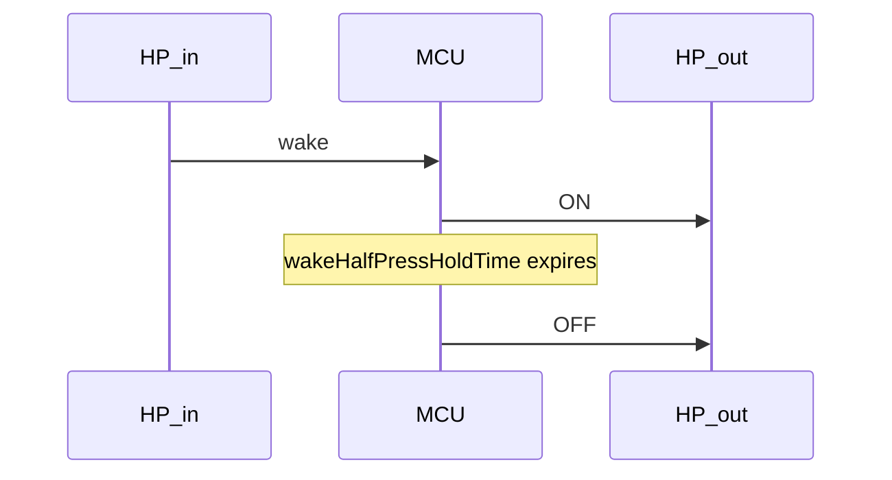
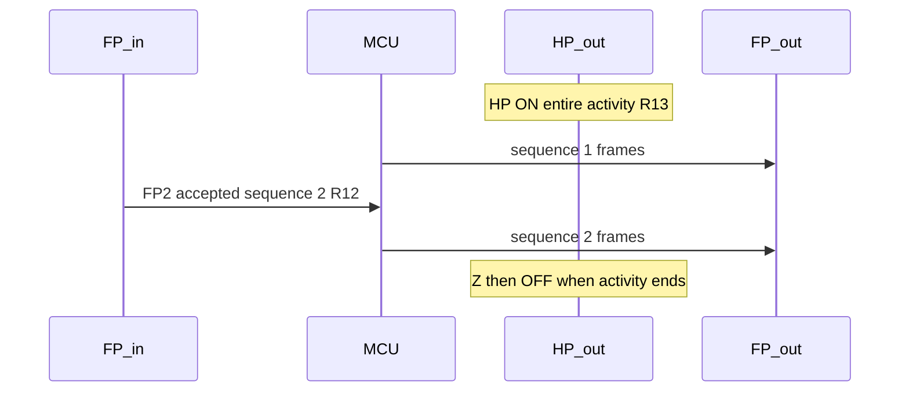
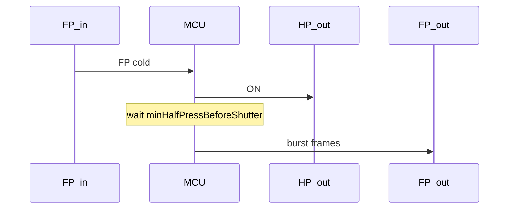
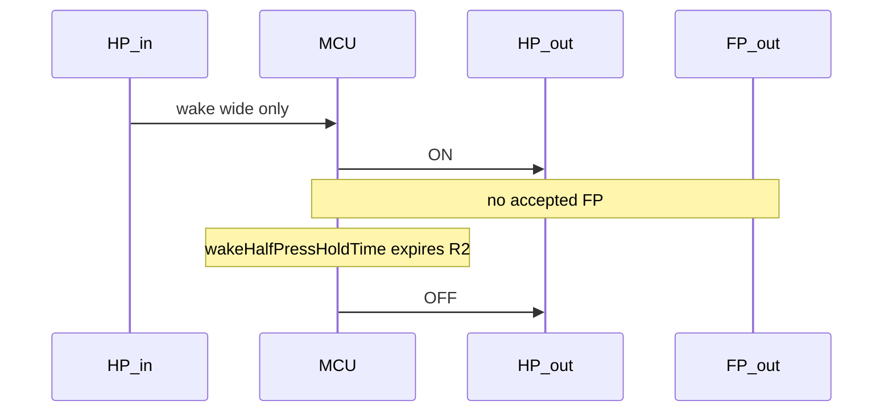
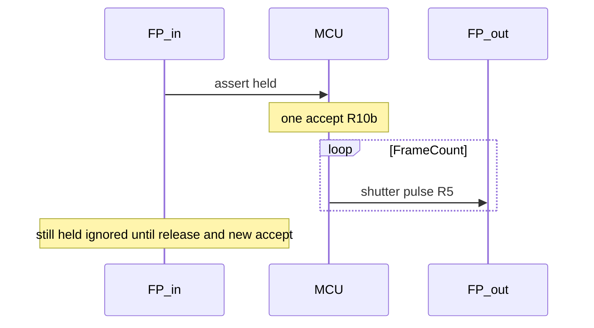
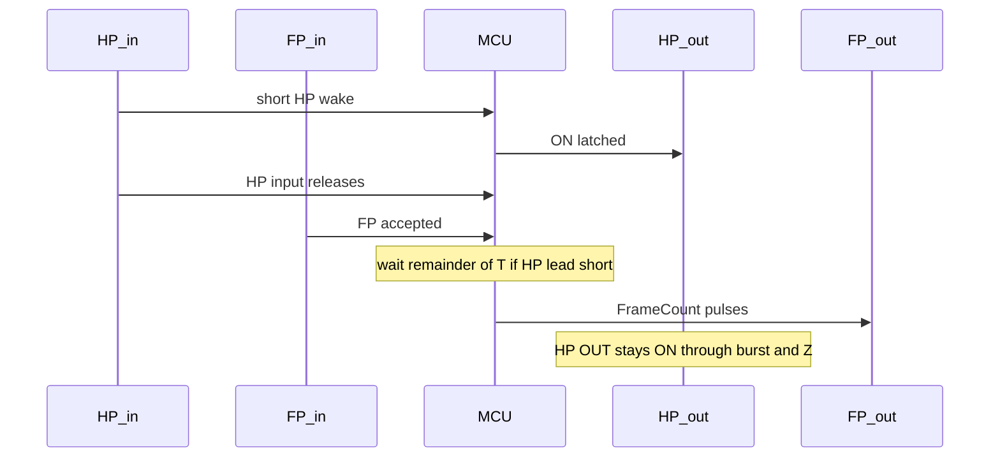

# Operational scenarios

Primary specification artifact for timing behavior. Each scenario has a stable ID for acceptance tests, customer explanations, and parameter tuning.

**Related docs:** [behavior-spec.md](behavior-spec.md) (rules R1–R15) · [parameters.md](parameters.md) · [validation-test-plan.md](validation-test-plan.md) · [diagrams/](diagrams/)

## Traceability

| ID | Title | Key parameters | Policies / rules |
|--------|---------|----------------|----------------|
| SC-01 | Normal wake then shoot | `wakeHalfPressHoldTime`, `FrameCount`, `StartFrameSpacingMin`, `PostShutterHalfPressHoldTimeExtension` | R1, R4–R7, R11, R13, R15 |
| SC-02 | FP during sequence ignored | `fullPressIgnoreGap`, `FrameCount`, `StartFrameSpacingMin` | R9, R10, R10b, R13 |
| SC-03 | FP flood during burst ignored | `fullPressIgnoreGap`, `FrameCount`, `StartFrameSpacingMin` | R10, R10b, R13 |
| SC-04 | Wake timeout | `wakeHalfPressHoldTime` | R2 |
| SC-04b | Repeated wake pulses | `wakeHalfPressHoldTime` | R1 |
| SC-05 | Back-to-back sequence | `MaxSequenceCount`, `PostShutterHalfPressHoldTimeExtension` | R4, R12, R15 |
| SC-05b | FP during post-shutter HP hold extension | `PostShutterHalfPressHoldTimeExtension` | R11, R12, R15 |
| SC-06 | Cold FP (no prior wake) | `minHalfPressBeforeShutter`, `fullPressWithoutPriorHpPolicy` | R3, R4 |
| SC-07 | HP during burst | `halfPressDuringBurstPolicy` | R13, R14 |
| SC-07b | HP during post-burst hold | `PostShutterHalfPressHoldTimeExtension` | R1, R11 |
| SC-08 | FP before HP | `minHalfPressBeforeShutter`, `fullPressWithoutPriorHpPolicy` | R3, R4 |
| SC-09 | FP at MaxSequenceCount cap | `MaxSequenceCount`, `StartFrameSpacingMin`, `FrameCount` | R10b, TimeOut |
| SC-10 | Recovery after cap | `MaxSequenceCount`, `StartFrameSpacingMin`, `FrameCount` | R12, TimeOut |
| SC-11 | StartFrameSpacingMin vs T (Y) | `StartFrameSpacingMin`, `minHalfPressBeforeShutter` | R4, R6, R7 |
| SC-12 | HP only (PIR Gap minimum) | `wakeHalfPressHoldTime` | R1, R2, R13 |
| SC-13 | Input line bounce (debounce) | `halfPressInputDebounce`, `fullPressInputDebounce` | R1, R10b |
| SC-14 | Held vs pulsed FP input | `fullPressInputDebounce` | R10b |
| SC-15 | Power-save performance budget | `powerSaveIdleMode` | R4 |
| SC-16 | HP input released immediately after FP | `minHalfPressBeforeShutter`, `PostShutterHalfPressHoldTimeExtension` | R4, R7, R13, R15 |
| SC-17 | First frame gated by short HP lead | `minHalfPressBeforeShutter`, `StartFrameSpacingMin` | R4, R6, R7 |
| SC-18 | HP chatter/release during burst | `halfPressDuringBurstPolicy`, `StartFrameSpacingMin` | R7, R13, R14 |
| SC-19 | New event after HP release | `minHalfPressBeforeShutter`, `wakeHalfPressHoldTime`, `PostShutterHalfPressHoldTimeExtension` | R3, R4, R12 |
| SC-20 | T greater than Y interaction | `minHalfPressBeforeShutter`, `StartFrameSpacingMin` | R4, R6, R7 |

### Illustrative defaults (examples in this doc)

| Parameter | Example value |
|--------------|---------------|
| `wakeHalfPressHoldTime` | 10 s |
| `minHalfPressBeforeShutter` | 0.5 s |
| `FrameCount` | 4 |
| `StartFrameSpacingMin` | 1.0 s |
| `PostShutterHalfPressHoldTimeExtension` | 2.0 s |
| `MaxSequenceCount` | 4 per activity |
| `fullPressIgnoreGap` | 3.1 s (estimate (N-1)×Y + pulse) |
| `shutterPulseDuration` | 100 ms |
| PIR Gap | minimum (0.5 s) — see [pir-sensor-settings.md](pir-sensor-settings.md) |

---

## Scenario template

Each defined scenario uses:

- **Intent** — real-world situation
- **Preconditions** — MCU state before inputs
- **Input timeline** — HP/FP from trigger system
- **Expected behavior** — camera outputs and counters
- **Status** — `defined` | `needs decision`

---

## SC-01 — Normal wake then shoot

**Status:** defined

**Intent:** Typical trap event: wide motion wakes the camera, subject enters narrow FOV about a second later, full burst fires, system returns to sleep.

**Preconditions:** Idle. `sequencesStartedThisActivity = 0`.

**Input timeline**

| Time | Input |
|------|--------|
| t=0 | HP wake (wide PIR) |
| t=1.0 s | FP (narrow PIR) |
| — | No further FP |

**Expected behavior**

1. On HP: assert camera HP ON; start `wakeHalfPressHoldTime` (R1, R13).
2. At t=1.0 s: HP lead ≥ `minHalfPressBeforeShutter` → **sequence 1** starts; schedule `FrameCount` frames (R4, R10b). Accepted FP does not refresh wake timer (R15).
3. Fire frames on `StartFrameSpacingMin` schedule (rising-edge to rising-edge on FP OUT starts, R6) with `shutterPulseDuration` each (R5); HP latched throughout (R7); `minHalfPressBeforeShutter` only gates frame 1 if needed (see behavior-spec burst scheduling).
4. After last frame: hold HP for `PostShutterHalfPressHoldTimeExtension` (R11). Activity ends; release HP → idle.

**Outputs:** 1 sequence, 4 frames (if `FrameCount=4`). HP latched from t=0 through post-burst hold.

**Parameters:** `wakeHalfPressHoldTime`, `minHalfPressBeforeShutter`, `FrameCount`, `shutterPulseDuration`, `StartFrameSpacingMin`, `PostShutterHalfPressHoldTimeExtension`

**Rules:** R1, R4, R5, R6, R7, R11, R13, R15

Canonical waveform: [timing-sequences § Nominal path](diagrams/timing-sequences.md#nominal-path-defaults).



---

## SC-02 — FP during sequence ignored

**Status:** defined

**Intent:** PIR **Gap = minimum** — narrow PIR may retrigger during the whole burst. MCU ignores **all** FP inputs for the **entire sequence**, not just after each shutter pulse.

**Preconditions:** Sequence in progress (first FP already accepted). `FrameCount = 4`, `StartFrameSpacingMin = 1.0 s`, `shutterPulseDuration = 100 ms`.

**`fullPressIgnoreGap`:** 3.1 s in this trace (`(4 - 1) × 1.0 + 0.1` per registry default estimate).

| Step | Event | Frames fired | Notes |
|------|-------|--------------|-------|
| 1 | HP, FP @1 s | — | Sequence starts (R10b); R10 ignore ON |
| 2 | FP #2 @1.3 s (during burst) | — | **Ignored** (R10 / `fullPressIgnoreGap`) |
| 3 | Frames 1–4 on schedule | 4 | Unchanged schedule |
| 4 | Sequence complete | 4 | R10 ignore OFF when gap elapsed; post-burst (R11) |

**Expected behavior**

- Any FP within `fullPressIgnoreGap` after sequence start is **discarded** (R10).
- Total frames = `FrameCount` (4).

**Parameters:** `fullPressIgnoreGap`, `FrameCount`, `StartFrameSpacingMin`, `shutterPulseDuration`

**Rules:** R9, R10, R10b, R13



---

## SC-03 — FP flood during burst ignored

**Status:** defined

**Intent:** Subject lingers in narrow beam with **PIR Gap minimum**; many FP pulses during one sequence. Only the **first accepted** FP starts the sequence; all others during the sequence are ignored (R10).

**Preconditions:** As SC-01; FP pulses arrive continuously during burst.

**Expected behavior**

1. First FP schedules `FrameCount` frames (R10b); R10 ignore for `fullPressIgnoreGap`.
2. All further FP inputs within `fullPressIgnoreGap` are **discarded** (R10).
3. MCU fires exactly `FrameCount` for that **one sequence** — retriggers do not add sequences.
4. **HP during activity:** `activityHalfPressHoldPolicy = holdUntilActivityEnd` (R13).
5. A second **accepted** FP after the sequence completes would start sequence 2 (same activity), subject to `MaxSequenceCount` — not SC-03.

**Example:** `FrameCount=4`, many FP inputs during one burst → **4 frames, 1 sequence**.

**Parameters:** `fullPressIgnoreGap`, `FrameCount`, `StartFrameSpacingMin`, `activityHalfPressHoldPolicy`

**Rules:** R10, R10b, R13



---

## SC-04 — Wake timeout (no FP)

**Status:** defined

**Intent:** Motion in wide FOV but subject never enters narrow beam; camera should not stay awake indefinitely.

**Preconditions:** Idle.

**Input timeline**

| Time | Input |
|------|--------|
| t=0 | HP wake |
| — | No FP before `wakeHalfPressHoldTime` |

**Expected behavior**

1. Assert camera HP ON (R1).
2. No FP within `wakeHalfPressHoldTime` (default 10 s) → release HP → idle (R2).

**Parameters:** `wakeHalfPressHoldTime`

**Rules:** R2



---

## SC-04b — Repeated wake pulses

**Status:** defined

**Intent:** Glitchy wide PIR keeps pulsing HP input while waiting for subject.

**Preconditions:** Idle or wake-active, no FP yet (wake hold only).

**Input timeline:** HP pulses at irregular intervals within the hold window.

**Expected behavior**

- Repeated HP pulses while HP is already latched do not extend wake timeout.
- HP release timing remains governed by initial wake timeout and post-frame hold rule (R15).

**Parameters:** `wakeHalfPressHoldTime`, `halfPressInputDebounce` (`wakeHoldRefreshPolicy` is a legacy/no-op compatibility field)

**Rules:** R1

---

## SC-05 — Back-to-back sequence

**Status:** defined

**Intent:** First sequence finishes; another FP arrives soon after. Same **activity** (HP often still latched); must respect AF (R4) and sequence boundary (R12). FP acceptance does not refresh wake timeout (R15).

**Preconditions:** Sequence 1 burst complete; `sequencesStartedThisActivity = 1`; `MaxSequenceCount ≥ 2`.

**Input timeline**

| Time | Input |
|------|--------|
| — | Sequence 1 completes (`FrameCount` frames + Z hold extension) |
| t=0 (relative) | FP accepted for sequence 2 (after last FP **output** of sequence 1) |

**Expected behavior**

1. **New sequence** in the **same activity** (R12) — `sequencesStartedThisActivity` becomes 2.
2. Before first FP **output** of sequence 2 (R12, R4):
   - Sequence 1 burst schedule **complete**; `fullPressIgnoreGap` elapsed (R10 ended)
   - `minHalfPressBeforeShutter` satisfied (often already met if HP never dropped)
3. On sequence 2 FP accept, do not refresh wake timeout; release still follows max-rule timing (R15).
4. Sequence 2 runs `FrameCount` frames; R10 ignore applies for `fullPressIgnoreGap` on sequence 2.

**Parameters:** `minHalfPressBeforeShutter`, `MaxSequenceCount`, `FrameCount`, `PostShutterHalfPressHoldTimeExtension`, `StartFrameSpacingMin`

**Rules:** R4, R10, R12, R15

See also [timing-sequences § SC-05](diagrams/timing-sequences.md#f--sc-05-back-to-back-sequence).



---

## SC-05b — FP during post-shutter HP hold extension

**Status:** defined

**Intent:** Narrow PIR fires again while camera HP still held after burst.

**Preconditions:** Burst schedule complete; in `PostShutterHalfPressHoldTimeExtension`; HP ON.

**Input timeline:** FP during post-burst window.

**Expected behavior**

- Treat as **start of new sequence** (R12) in same activity if under `MaxSequenceCount`.
- Prior sequence must be **complete** (R10 cleared).
- On FP accept, do not refresh wake timeout (R15). HP release remains governed by the max-rule hold boundary.

**Parameters:** `PostShutterHalfPressHoldTimeExtension`, `minHalfPressBeforeShutter`

**Rules:** R11, R12, R15

---

## SC-06 — Cold FP (no prior wake)

**Status:** defined

**Intent:** Subject enters narrow FOV before or without wide PIR wake; camera asleep.

**Preconditions:** Idle, camera HP not latched by MCU.

**Input timeline:** FP only (no HP).

**Expected behavior**

1. Assert camera HP immediately (R3; `fullPressWithoutPriorHpPolicy = assertHpThenWait` — see [parameters.md § `fullPressWithoutPriorHpPolicy`](parameters.md#fullpresswithoutpriorhppolicy)).
2. Wait `minHalfPressBeforeShutter` (R4).
3. Run burst per `FrameCount` (R5–R6); accepted FP does not refresh wake timeout (R15).

**Parameters:** `minHalfPressBeforeShutter`, `fullPressWithoutPriorHpPolicy`, `FrameCount`

**Rules:** R3, R4



---

## SC-07 — HP during active burst

**Status:** defined

**Intent:** Wide PIR chatter while burst in progress must not disrupt shutter schedule or drop AF.

**Preconditions:** Burst active; `remainingFrames > 0` or shutter pulse in progress.

**Input timeline:** Additional HP pulses during burst.

**Expected behavior**

- `halfPressDuringBurstPolicy = independent` (R14): HP input **ignored** for burst scheduling — see [parameters.md § `halfPressDuringBurstPolicy`](parameters.md#halfpressduringburstpolicy).
- Camera HP remains under activity/burst rules (R13) — no release from HP input.
- Does **not** reset `remainingFrames`, does **not** add frames, does **not** emit extra FP.

**Parameters:** `halfPressDuringBurstPolicy`, `halfPressInputDebounce`

**Rules:** R13, R14

---

## SC-07b — HP during post-burst hold

**Status:** defined

**Intent:** Motion continues after burst; keep camera ready without firing.

**Preconditions:** Post-burst hold active; HP OUT already ON.

**Expected behavior**

- HP input alone does not schedule frames and does not refresh wake timeout while HP is already latched (R1, R15).
- FP during this window → SC-05b (R12, R15 on accept).
- When post-burst hold ends and sequence cap still allows more sequences, firmware returns to wake/AF waiting for the next FP; it does not end solely because wake deadline elapsed during active hold.

**Parameters:** `PostShutterHalfPressHoldTimeExtension` (`wakeHoldRefreshPolicy` is a legacy/no-op compatibility field)

**Rules:** R1, R11

---

## SC-08 — FP before HP

**Status:** defined

**Intent:** Fast animal: narrow beam triggers before wide wake is recognized.

**Preconditions:** Idle.

**Input timeline:** FP at t=0; HP at t=0.2 s (or never).

**Expected behavior**

- FP path dominates: same as SC-06 until HP arrives.
- If HP arrives during cold-wait or burst: R14 during burst; during cold-wait, HP assert is redundant if already latched.
- If HP never arrives, behavior remains SC-06.

**Parameters:** Same as SC-06, SC-07

**Rules:** R3, R4, R14

---

## SC-09 — FP when MaxSequenceCount reached

**Status:** defined

**Intent:** Subject keeps triggering narrow PIR; limit how many **full-press sequences** run in one activity (not frames per sequence).

**Preconditions:** `sequencesStartedThisActivity >= MaxSequenceCount`; current sequence burst may be draining or between sequences.

**Expected behavior**

- On cap hit (`sequencesStartedThisActivity >= MaxSequenceCount`), firmware enters **TimeOut**.
- During TimeOut, both FP and HP inputs are ignored for sequence triggering.
- TimeOut duration is `StartFrameSpacingMin * FrameCount`.

**Example:** `MaxSequenceCount = 4`, `FrameCount = 4` → up to **4 sequences**, up to **16 frames** in one activity if every sequence runs full burst.

**Parameters:** `MaxSequenceCount`, `StartFrameSpacingMin`, `FrameCount`

**Rules:** R10b, R13, TimeOut

---

## SC-10 — Recovery after MaxSequenceCount cap

**Status:** defined

**Intent:** After a capped event enters and exits TimeOut, the next eligible FP should start a fresh sequence again.

**Preconditions:** Prior cap event occurred and TimeOut window elapsed.

**Input timeline:** FP after idle.

**Expected behavior**

- Post-timeout FP is accepted again and can start a new sequence.
- Normal R4 / R10 / R12 gates apply.

**Rules:** R12, TimeOut

---

## SC-11 — StartFrameSpacingMin vs minHalfPressBeforeShutter

**Status:** defined

**Intent:** Confirm burst schedule: `StartFrameSpacingMin` is the **minimum** start-to-start spacing (excludes `shutterPulseDuration`); `minHalfPressBeforeShutter` is a per-frame gate only, not added between every frame when HP stays latched. Actual spacing may exceed Y if T (or HP release) delays the next start — e.g. between sequences when `PostShutterHalfPressHoldTimeExtension` is low and T > Y.

**Preconditions:** Sequence in progress; HP OUT held through burst (normal).

**Expected behavior**

| Scope | Rule |
|-------|------|
| **Within sequence** | Frame k+1 FP OUT start at t_k + `StartFrameSpacingMin` (R6, rising-edge to rising-edge); no extra T wait if HP never dropped |
| **Between sequences** | Prior sequence burst complete + `PostShutterHalfPressHoldTimeExtension` before next sequence (SC-05) |

**Parameters:** `StartFrameSpacingMin`, `minHalfPressBeforeShutter`, `PostShutterHalfPressHoldTimeExtension`, `FrameCount`, `shutterPulseDuration`

**Rules:** R4, R6, R7, R10, R12

---

## SC-12 — HP only (PIR Gap minimum)

**Status:** defined

**Intent:** Field acceptance with **PIR Gap = minimum** ([pir-sensor-settings.md](pir-sensor-settings.md)): subject in wide FOV only — camera wakes and holds HP, but never gets a valid narrow FP. Confirms wake-only path does not depend on PIR gap for timeout, and that minimum gap on the narrow sensor does not cause spurious bursts when no narrow detection occurs.

**Preconditions:** Idle. PIR deployed per pir-sensor-settings (Gap minimum, NUM = 1, wide = Wake, far = Normal). MCU registry defaults unless noted.

**Test setup**

1. Block or aim away the **far** (narrow) sensor so only wide motion is possible, **or** use wide-only motion in the field.
2. Record HP IN, FP IN, HP OUT, FP OUT (logic analyzer or scope).

**Input timeline**

| Time | Input |
|------|--------|
| t=0 | HP wake (wide PIR) |
| t=0 … X | Optional repeated HP pulses (wide chatter) |
| — | No debounced FP before `wakeHalfPressHoldTime` |

Use `wakeHalfPressHoldTime` = 10 s (illustrative default) unless testing a shorter configured value.

**Expected behavior**

1. First debounced HP: assert camera HP OUT; start `wakeHalfPressHoldTime` (R1).
2. Further debounced HP pulses before any accepted FP: do not move the wake deadline while HP is already latched; HP OUT stays on until timeout from the initial assert (R1, SC-04b).
3. No FP IN → no FP OUT, `sequencesStartedThisActivity` stays 0 (R10b never starts a sequence).
4. When `wakeHalfPressHoldTime` expires with no accepted FP: release HP OUT → idle (R2).

**Pass criteria**

| Check | Expected |
|-------|----------|
| HP OUT | ON from first valid HP through hold window; OFF after timeout |
| FP OUT | No pulses |
| Sequences / frames | 0 |

**Note:** If narrow PIR **does** fire during a later SC-01-style shoot, retriggers during a burst are covered by SC-02 / SC-03 (`fullPressIgnoreGap`, R10) — not part of this HP-only test.

**Parameters:** PIR Gap minimum, `wakeHalfPressHoldTime`, `halfPressInputDebounce`

**Rules:** R1, R2, R13



---

## SC-13 — Input line bounce (debounce)

**Status:** defined

**Intent:** Acceptance test that **contact bounce and short electrical glitches** on HP IN and FP IN do not toggle camera outputs or start sequences. Validates `halfPressInputDebounce` and `fullPressInputDebounce` under controlled bounce.

**Preconditions:** Idle unless noted. Fix debounce constants for the run and record them in the test log.

**Test setup**

- Inject a **synthetic bounce train** on HP IN or FP IN (bench GPIO / fixture), **or** capture a known-noisy line and replay it.
- Configure explicit debounce values for the run, e.g. `halfPressInputDebounce` = 30 ms, `fullPressInputDebounce` = 20 ms (within registry ranges in [parameters.md](parameters.md)).
- Monitor HP OUT and FP OUT; use the same `inputActivePolarity` as production.

**Case A — HP bounce below debounce (idle)**

| Time (relative) | HP IN (active-low example) |
|-----------------|----------------------------|
| 0 ms | Assert 8 ms |
| 10 ms | Release 5 ms |
| 17 ms | Assert 6 ms |
| 25 ms | Release (remain idle) |

All active segments shorter than `halfPressInputDebounce`; line not stable-active long enough to debounce.

**Expected:** No HP OUT assert; MCU remains idle. No FP OUT.

**Case B — HP valid after debounce**

| Time | HP IN |
|------|--------|
| 0 ms | Assert and hold stable ≥ `halfPressInputDebounce` + margin |

**Expected:** HP OUT asserts once (R1); `wakeHalfPressHoldTime` running. No spurious HP OUT toggles from prior bounce in Case A if cases are run separately.

**Case C — FP bounce below debounce (idle)**

Same pattern as Case A on FP IN with segment lengths &lt; `fullPressInputDebounce`.

**Expected:** No FP OUT; no sequence start (R10b).

**Case D — FP bounce during wake hold**

**Preconditions:** HP OUT already on (Case B or wide wake).

Inject FP bounce trains as in Case C while HP hold active.

**Expected:** No FP OUT; wake hold unchanged except valid HP refresh (SC-04b). No `sequencesStartedThisActivity` increment.

**Pass criteria**

| Signal | Bounce cases (A, C, D) | Valid pulse (B) |
|--------|------------------------|-----------------|
| HP OUT | No transition from bounce alone | Assert once when stable HP meets debounce |
| FP OUT | No pulses | N/A in Case B |
| Sequence / frame counters | Unchanged on FP bounce | — |

**Parameters:** `halfPressInputDebounce`, `fullPressInputDebounce`, `inputActivePolarity`

**Rules:** R1, R10b

---

## SC-14 — Held vs pulsed FP input

**Status:** defined

**Intent:** Some triggers present FP as a **short pulse**; others hold the line active for hundreds of milliseconds or longer. The MCU must treat a continuous assert as **one** accepted FP (one sequence start), not as a burst of separate triggers.

**Preconditions:** Idle, or prior sequence complete and `fullPressIgnoreGap` elapsed (for “second shot” sub-test). HP OUT on via prior wake (SC-01 path) or will be asserted on cold FP (SC-06 path).

**Test setup**

- Record FP IN and FP OUT.
- Set `fullPressInputDebounce` = 20 ms (example).
- Use `FrameCount` = 4, `StartFrameSpacingMin` = 1.0 s so schedule is easy to verify.

**Case A — Pulsed FP (reference)**

| Time | FP IN |
|------|--------|
| t=0 | Debounced assert ≥ `fullPressInputDebounce`, then release before next frame |

**Expected:** One sequence; `FrameCount` FP OUT pulses on schedule (R5, R6). R10 ignore for `fullPressIgnoreGap` after accept.

**Case B — Held FP (level)**

| Time | FP IN |
|------|--------|
| t=0 | Debounced assert |
| t=0 … end of burst + gap | Hold active continuously (no release) |

**Expected:**

1. **One** debounced accept at first stable assert → **one** sequence (R10b).
2. `FrameCount` frames only — hold duration does **not** add frames or restart the sequence.
3. While held, input does not count as additional FP accepts (same as R10 / ignore semantics for duplicate triggers during the sequence window).
4. FP OUT: `FrameCount` pulses with `shutterPulseDuration`; spacing per R6 — not one long FP OUT level.

**Case C — Release and re-assert (two sequences)**

| Time | FP IN |
|------|--------|
| t=0 | Held assert → sequence 1 completes |
| — | Release and idle ≥ `fullPressInputDebounce` |
| t₁ | Second debounced assert |

**Expected:** Second accept only after prior sequence burst complete + `fullPressIgnoreGap` + debounced re-assert (SC-05 / R12). Two sequences if under `MaxSequenceCount`.

**Pass criteria**

| Case | FP OUT pulse count (one sequence) | Sequence count |
|------|-----------------------------------|----------------|
| A (pulse) | `FrameCount` | 1 |
| B (hold) | `FrameCount` (not 1 long pulse) | 1 |
| C | `FrameCount` per accept | 2 (if gates met) |

**Parameters:** `fullPressInputDebounce`, `FrameCount`, `StartFrameSpacingMin`, `shutterPulseDuration`, `fullPressIgnoreGap`

**Rules:** R5, R6, R10, R10b, R12



---

## SC-15 — Power-save performance budget

**Status:** defined

**Intent:** Measure whether **power-save idle** materially slows input-to-output response. When `powerSaveIdleMode` is enabled, the extra latency versus fully awake must stay **under 1 ms** so trap timing is not compromised.

**Preconditions:** MCU idle for ≥ 1 s between trials (longer if firmware defines a deeper sleep settle time). Same stimulus and wiring for both runs.

**Requirement**

Compare two configurations on the **same** test path:

| Run | `powerSaveIdleMode` | Meaning |
|-----|---------------------|---------|
| Baseline | `disabled` | MCU always awake between events |
| DUT | `enabled` | MCU sleeps when idle; first edge after idle must wake |

Let:

- `t_disabled` = time from debounced **input active edge** to first relevant **output active edge**
- `t_enabled` = same measurement with power save on after idle sleep

**Pass:** `t_enabled − t_disabled` **&lt; 1 ms** (report max or p99 over ≥ 20 trials per path).

R4 (`minHalfPressBeforeShutter`) and burst scheduling are **unchanged** once awake — this scenario measures **wake + debounce + first OUT response**, not shortening AF lead.

**Test paths** (run each with both modes)

| Path | Stimulus | Measure to |
|------|----------|------------|
| P1 — HP wake | Debounced HP IN assert from idle | HP OUT assert edge |
| P2 — Cold FP | Debounced FP IN assert from idle (no prior HP) | HP OUT assert edge (cold path, R3) |
| P3 — FP shutter (optional) | Accepted FP with HP already latched | First FP OUT pulse start of sequence |

Record debounce settings, temperature, and supply voltage in the log. Outliers from scope trigger error do not satisfy the budget.

**Expected behavior (functional)**

- With `enabled`, first input after idle still produces correct HP/FP OUT behavior; no skipped sequences once gates are met.
- With `disabled`, same functional outcome; latency is the performance baseline.

**Parameters:** `powerSaveIdleMode`, `halfPressInputDebounce`, `fullPressInputDebounce`

**Rules:** R4 (gates apply after wake; not waived by power save)

---

## SC-16 — HP input released immediately after FP

**Status:** defined

**Intent:** Some trigger systems provide HP as a short wake pulse and then release it, including cases where HP has already released by the time FP arrives or releases immediately after FP. In state-machine mode, camera HP OUT is latched by the MCU activity rules; physical HP input release is not a camera HP release command.

**Preconditions:** Idle. Use nominal `FrameCount`, `StartFrameSpacingMin`, `shutterPulseDuration`, and `PostShutterHalfPressHoldTimeExtension`. Set `minHalfPressBeforeShutter` to a visible value such as 0.5 s.

**Input timeline**

| Time | Input |
|------|-------|
| t=0 | HP wake pulse, then release after a short duration |
| t=100 ms | FP pulse; HP input may already be released |
| — | No further HP input |

**Expected behavior**

1. HP pulse asserts camera HP OUT and starts the wake hold (R1).
2. FP is accepted and starts sequence 1 if gates pass; accepted FP does not refresh wake timeout (R15).
3. Camera HP OUT remains asserted through the burst and `PostShutterHalfPressHoldTimeExtension` even though HP input is released (R7, R13).
4. If the HP lead at FP accept is shorter than `minHalfPressBeforeShutter`, frame 1 waits until HP OUT has been active for T (R4).
5. Frames 2..N follow `StartFrameSpacingMin`; no extra T wait is inserted while HP OUT remains latched.

**Pass criteria**

| Check | Expected |
|-------|----------|
| HP OUT | No drop when HP IN releases; held through burst and Z |
| First FP OUT | Starts no earlier than `HP_OUT assert + minHalfPressBeforeShutter` |
| Frames 2..N | Start-to-start spacing follows `StartFrameSpacingMin` |
| Sequence count | 1 |

**Parameters:** `minHalfPressBeforeShutter`, `FrameCount`, `StartFrameSpacingMin`, `PostShutterHalfPressHoldTimeExtension`

**Rules:** R4, R7, R13, R15



---

## SC-17 — First frame gated by short HP lead

**Status:** defined

**Intent:** Make the first-frame timing effect of `minHalfPressBeforeShutter` explicit. T gates the first FP OUT only when HP OUT lead is inadequate; it is not added before every frame.

**Preconditions:** Idle before each variant. Use `minHalfPressBeforeShutter = 0.5 s`, `StartFrameSpacingMin = 1.0 s`, and `FrameCount = 4` unless the test is sweeping those values.

**Input variants**

| Variant | Stimulus | Expected first FP OUT start |
|---------|----------|-----------------------------|
| Cold FP | FP at t=0, no HP input | `HP_OUT assert + T` |
| Short lead | HP at t=0, FP at t=100 ms | t=500 ms |
| Exact lead | HP at t=0, FP at t=500 ms | t=500 ms, subject to debounce/latency |
| Warm lead | HP at t=0, FP at t=1.0 s | FP accept time |

**Expected behavior**

The first FP OUT start follows:

```text
first FP_OUT start = max(FP accept time, HP_OUT assert time + minHalfPressBeforeShutter)
```

Frames 2..N follow:

```text
next FP_OUT start >= previous FP_OUT start + StartFrameSpacingMin
```

**Parameters:** `minHalfPressBeforeShutter`, `StartFrameSpacingMin`, `FrameCount`

**Rules:** R4, R6, R7

---

## SC-18 — HP chatter/release during burst does not affect FPS

**Status:** defined

**Intent:** Wide PIR chatter during a burst must not change the output frame rate. HP input pulses, releases, or absence during the burst do not reset the burst schedule, add frames, delay frames, or drop camera HP OUT.

**Preconditions:** A sequence is active. HP OUT is latched. Use a visible `StartFrameSpacingMin`, such as 1.0 s.

**Input timeline**

| Time | Input |
|------|-------|
| t=0 | Start a normal sequence |
| Between frame 1 and frame N | Inject HP input pulses and releases |
| — | Optional: keep HP input inactive after the chatter |

**Expected behavior**

- `halfPressDuringBurstPolicy = independent`: HP input during the burst is ignored for scheduling (R14).
- Camera HP OUT does not drop because of HP input release or chatter (R7, R13).
- `frameStartSpacingMs` remains governed by `StartFrameSpacingMin`.
- No frames are inserted, skipped, or delayed because of HP input activity.

**Parameters:** `halfPressDuringBurstPolicy`, `StartFrameSpacingMin`, `halfPressInputDebounce`

**Rules:** R7, R13, R14

---

## SC-19 — New event after HP release

**Status:** defined

**Intent:** Cover the case where effective photos-per-second changes across separate events because HP OUT has actually been released. The next FP must re-establish HP lead before the first output FP.

**Preconditions:** Prior activity has fully ended: post-burst hold is complete, any wake hold requirement has expired, HP OUT is released, and the MCU is idle.

**Input timeline**

| Time | Input |
|------|-------|
| t=0 | FP only, or FP before any new HP |
| Optional | HP input arrives later |

**Expected behavior**

1. Treat the event as a cold/short-lead start (SC-06/SC-08).
2. Assert HP OUT immediately on accepted cold FP if `fullPressWithoutPriorHpPolicy = assertHpThenWait` (R3).
3. Delay first FP OUT until `minHalfPressBeforeShutter` has elapsed since HP OUT assertion (R4).
4. Frames 2..N in the new sequence follow `StartFrameSpacingMin` while HP OUT remains latched.

**Parameters:** `minHalfPressBeforeShutter`, `wakeHalfPressHoldTime`, `PostShutterHalfPressHoldTimeExtension`, `fullPressWithoutPriorHpPolicy`

**Rules:** R3, R4, R12

---

## SC-20 — T greater than Y interaction

**Status:** defined

**Intent:** Prevent a parameter interpretation error when `minHalfPressBeforeShutter` is longer than `StartFrameSpacingMin`. T can delay frame 1 after inadequate HP lead, but it must not be added before every later frame while HP OUT stays latched.

**Preconditions:** Configure `minHalfPressBeforeShutter > StartFrameSpacingMin`, for example T = 2.0 s and Y = 0.5 s. Use `FrameCount >= 3`.

**Variants**

| Variant | Stimulus | Expected |
|---------|----------|----------|
| Warm latched HP | HP lead already greater than T before FP | Frame 1 starts on FP accept; frames 2..N follow Y |
| Cold/short lead | FP before adequate HP lead | Frame 1 waits T; frames 2..N follow Y from frame 1 start |

**Expected behavior**

- Warm-latched sequence: T has no visible effect on frame spacing because HP lead is already satisfied.
- Cold/short-lead sequence: T delays the first FP OUT only.
- `StartFrameSpacingMin` remains the burst cadence reference for frames 2..N.

**Parameters:** `minHalfPressBeforeShutter`, `StartFrameSpacingMin`, `FrameCount`

**Rules:** R4, R6, R7
