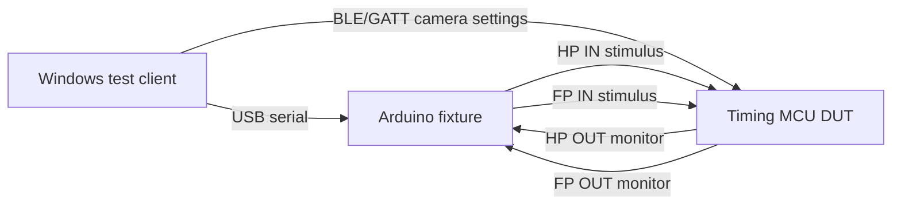

# Validation test plan

This plan validates the timing MCU behavior described by [scenarios.md](scenarios.md), [behavior-spec.md](behavior-spec.md), and [parameters.md](parameters.md). It covers every scenario from SC-01 through SC-20, timing accuracy, input-to-output latency, practical parameter extremes, and repeatable fixture-driven execution.

## Goals

1. Prove that each SC-xx scenario produces the expected HP/FP outputs and sequence/frame counts.
2. Measure timing accuracy for every timing parameter that affects camera behavior.
3. Measure input-to-output latency, including the `powerSaveIdleMode` comparison in SC-15.
4. Validate practical short, nominal, and long values for user-facing parameters.
5. Produce repeatable logs that can be compared across firmware revisions and hardware builds.

## Source of truth

| Source | Validation use |
|--------|----------------|
| [scenarios.md](scenarios.md) | Scenario intent, inputs, and expected behavior |
| [behavior-spec.md](behavior-spec.md) | Rules R1-R15 and sequence/activity definitions |
| [parameters.md](parameters.md) | Parameter names, defaults, units, and enum behavior |
| [diagrams/timing-sequences.md](diagrams/timing-sequences.md) | Canonical timing examples and reference waveforms |
| [pir-sensor-settings.md](pir-sensor-settings.md) | Field PIR setup assumptions, especially PIR Gap minimum |
| [../firmware/Camtraptions_Firmware.ino](../firmware/Camtraptions_Firmware.ino) | Implemented scaling, defaults, and persisted camera settings |

## Validation levels

| Level | Purpose | Required evidence |
|-------|---------|-------------------|
| L0 - document consistency | Confirm scenario, parameter, and rule names agree | Traceability table reviewed; no missing required SC IDs |
| L1 - fixture functional | Run each scenario with nominal parameters | Pass/fail per SC; HP/FP input/output trace |
| L2 - timing accuracy | Measure edge timing against configured values | Derived metrics table with tolerance result |
| L3 - parameter sweeps | Exercise practical short/nominal/long values | Sweep summary by parameter and scenario |
| L4 - performance | Measure latency and power-save delta | Per-path latency statistics, including SC-15 |
| L5 - field integration | Confirm real PIR behavior against bench assumptions | Field trace or bench replay using captured PIR pulses |

### L0 traceability matrix

Use this matrix as the pre-run consistency gate and keep it updated when scenarios/rules/params change.

| Scenario family | Rules | Primary parameters | Required fixture metrics | Required telemetry deltas | Expected state path |
|----------------|-------|--------------------|---------------------------|---------------------------|--------------------|
| SC-01/05/05b (nominal + multi-sequence) | R1, R4-R7, R10, R11, R12, R15 | `FrameCount`, `StartFrameSpacingMin`, `PostShutterHalfPressHoldTimeExtension`, `MaxSequenceCount` | `frameCount`, `frameStartSpacingMs`, `hpHoldAfterLastFrameMs`, `sequenceCount` | `acceptedFpCount`, `sequenceCompletedCount`, `activityCompletedCount` | `CAM_WAKE_AF -> CAM_BURST_ACTIVE -> CAM_POST_SHUTTER_EXT` (repeat as needed) |
| SC-02/03/14 (FP ignore behavior) | R10, R10b, R13 | `fullPressIgnoreGap`, `FrameCount`, `fullPressInputDebounce` | `ignoredFpCount`, `frameCount` | `ignoredFpDuringGapCount`, `ignoredFpDuringBurstCount` | `CAM_BURST_ACTIVE` remains stable |
| SC-04/04b/12 (wake-only hold) | R1, R2 | `wakeHalfPressHoldTime`, `wakeHoldRefreshPolicy` | `wakeOnlyHoldMs`, `hpInToHpOutLatencyMs` | `wakeTimeoutCount`, `hpRefreshCount` | `CAM_WAKE_AF -> CAM_IDLE` |
| SC-06/08/16/17/19/20 (AF gate paths) | R3, R4, R6, R7 | `minHalfPressBeforeShutter`, `StartFrameSpacingMin`, `fullPressWithoutPriorHpPolicy` | `firstFrameAfLeadMs`, `firstFrameGateDelayMs`, `frameStartSpacingMs` | `coldFpSequenceCount`, `acceptedFpCount` | `CAM_COLD_FP_WAIT` and/or warm `CAM_WAKE_AF` path |
| SC-07/07b/18 (HP during burst/post-hold) | R1, R11, R13, R14 | `halfPressDuringBurstPolicy`, `wakeHoldRefreshPolicy` | `hpOutContinuityMs`, `frameCount` | `hpIgnoredDuringBurstCount`, `hpRefreshCount` | `CAM_BURST_ACTIVE` / `CAM_POST_SHUTTER_EXT` stability |
| SC-09/10 (sequence cap handling) | R10b, R12, R13 | `MaxSequenceCount`, `fpAfterMaxSequenceCountPolicy` | `sequenceCount`, `frameCount` | `rejectedFpAtSequenceCapCount`, `activityCompletedCount` | Cap reached then idle recovery |
| SC-13 (debounce) | R1, R10b | `halfPressInputDebounce`, `fullPressInputDebounce` | Reject/accept edge outcomes | `hpDebounceRejectCount`, `fpDebounceRejectCount` | No unintended state transitions |
| SC-15 (power-save latency) | R4 | `powerSaveIdleMode` | P1/P2/P3 latency stats + delta | Optional snapshot only | Same logical path with/without power save |

## Test system

### Fixture architecture

An Arduino-class fixture sits next to the device under test (DUT). The fixture drives DUT inputs and monitors DUT outputs. A thin Windows client script controls the fixture over USB serial and changes DUT timing parameters using BLE/GATT.



The default fixture target is an Arduino Nano/Uno-class board. Its timing resolution is acceptable for the expected validation needs. If a future measurement shows the fixture is the limiting factor, replace the fixture with a faster board without changing the test-vector format.

### Fixture signal map

| Logical signal | Direction from fixture view | Notes |
|---------------|------------------------|-----------------------|
| `HP_IN_STIM` | Output to DUT HP input | Simulates wide PIR wake |
| `FP_IN_STIM` | Output to DUT FP input | Simulates narrow PIR full-press |
| `HP_OUT_MON` | Input from DUT HP output | Records camera half-press output |
| `FP_OUT_MON` | Input from DUT FP output | Records camera full-press output |
| `GND` | Shared reference | Required for active-low switch-closure style tests |

Use isolation or series protection appropriate for the actual hardware. The fixture must not drive voltage into an open-drain/opto output from the DUT or into camera-facing circuitry.

### Electrical assumptions

| Item | Default assumption | Validation note |
|-----------|--------------------|-----------------|
| Input polarity | `active-low` | Active means line pulled to ground |
| Output drive | `open-drain` or `opto` | Timing is measured by active edge and release edge |
| DUT mode | Camera device, state-machine enabled | Pass-through mode is outside this validation plan unless added later |
| Camera settings version | `CAMERA_SETTINGS_VERSION` 2 | Windows client must write/read the 20-byte camera config |

### Windows client responsibilities

1. Discover the Arduino fixture serial port.
2. Discover or select the DUT BLE device.
3. Read current DUT camera settings and save them in the test log.
4. Write the required parameter set before each test case using BLE/GATT.
5. Confirm the DUT accepted the settings by reading them back.
6. Send the fixture stimulus vector.
7. Collect fixture edge timestamps and status.
8. Calculate derived metrics and pass/fail results.
9. Save raw data, summary data, firmware version, parameter values, and operator notes.

### BLE/GATT parameter adapter

The Windows client should treat DUT configuration as an adapter layer. The validation cases name parameters using documentation names; the adapter maps them to the current camera config byte layout.

| Documentation parameter | Firmware field / scale |
|-------------------------|------------------------|
| `wakeHalfPressHoldTime` | `wakeHalfPressHoldSec` x 1000 ms |
| `minHalfPressBeforeShutter` | `minHalfPressBeforeShutter` x 100 ms |
| `shutterPulseDuration` | `shutterPulseDuration` x 10 ms |
| `StartFrameSpacingMin` | `startFrameSpacingTenths` x 100 ms |
| `PostShutterHalfPressHoldTimeExtension` | `postShutterHpHoldTenths` x 100 ms |
| `halfPressInputDebounce` | `hpDebounceMs` x 1 ms |
| `fullPressInputDebounce` | `fpDebounceMs` x 1 ms |
| `FrameCount` | `frameCount` |
| `MaxSequenceCount` | `maxSequenceCount` |
| `wakeHoldRefreshPolicy` | `wakeHoldRefreshPolicy` enum (0 extend / 1 restart / 2 ignoreWhileActive) |
| `halfPressDuringBurstPolicy` | `halfPressDuringBurstPolicy` enum (only 0 currently active) |
| `fullPressWithoutPriorHpPolicy` | `fullPressWithoutHpPolicy` enum |
| `activityHalfPressHoldPolicy` | `activityHalfPressHoldPolicy` enum (currently fixed/coerced) |
| `fpAfterMaxSequenceCountPolicy` | `fpAfterMaxSeqCountPolicy` enum |
| `inputActivePolarity` | `inputActivePolarity` enum (currently coerced to active-low) |
| `outputDriveMode` | `outputDriveMode` enum (currently coerced to open-drain) |
| `powerSaveIdleMode` | `powerSaveIdleMode` |
| `fullPressIgnoreGap` | `fullPressIgnoreGapTenths` x 100 ms |

The adapter must fail a test setup if a readback differs from the requested setting after scaling and clamping.

## Timing tolerances

Use percent-plus-floor tolerances unless a scenario defines a stricter requirement.

| Measurement | Default tolerance |
|----------------|-------------------|
| `shutterPulseDuration` | +/-1% or +/-5 ms, whichever is larger |
| `StartFrameSpacingMin` | +/-1% or +/-5 ms, whichever is larger |
| `minHalfPressBeforeShutter` gate | Actual first FP OUT must be no earlier than expected minus 5 ms |
| `wakeHalfPressHoldTime` | +/-1% or +/-20 ms, whichever is larger |
| `PostShutterHalfPressHoldTimeExtension` | +/-1% or +/-10 ms, whichever is larger |
| `fullPressIgnoreGap` behavior | Functional: no accepted FP before the gate clears |
| Input-to-output latency | Report min, mean, max, p95, p99 |
| SC-15 power-save delta | `t_enabled - t_disabled < 1 ms` |

For SC-15, the Arduino fixture can run the trials and report trends. If results approach the 1 ms limit or look noisy, confirm the final pass/fail result with a scope or logic analyzer.

### Automated timing assertion matrix

The harness must evaluate at least one explicit timing assertion for every timing-sensitive scenario family. Timing checks are pass/fail gates, not informational-only metrics.

| Scenario family | Required timing assertions | Default tolerance policy |
|----------------|----------------------------|--------------------------|
| SC-01, SC-02, SC-03, SC-07, SC-07b, SC-11, SC-14, SC-18 | `fpPulseWidthMs`, `frameStartSpacingMs` | +/-1% or +/-5 ms floor |
| SC-04, SC-04b, SC-12, AO-BLE-CONNECTED-SC04 | `wakeOnlyHoldMs` | +/-1% or +/-20 ms floor |
| SC-05, SC-05b, SC-16 | `hpHoldAfterLastFrameMs`, sequence-aware inter-sequence timing where applicable | +/-1% or +/-10 ms floor |
| SC-06, SC-08, SC-17, SC-20 | `firstFrameAfLeadMs` and/or `firstFrameGateDelayMs` | range gate (`minMs`/`maxMs`) or target +/- tolerance |
| SC-09, SC-10, SC-19 | sequence-aware timing (`interSequenceGapMs`, `secondSequenceStartDelayMs`) plus cap/recovery telemetry | +/-1% or +/-5 ms floor for spacing/delay checks |
| SC-13 | debounce counters as timing-proxy gates (`fpDebounceRejectCount`, `hpDebounceRejectCount`) | exact telemetry delta match |
| AO-BLE-CONNECTED-SC01, AO-DEFERRED-CONFIG-WRITES, AO-FACTORY-RESET-AND-COERCION | parity timing checks vs nominal behavior (`frameStartSpacingMs`, `fpPulseWidthMs` when pulses exist) | same tolerance as corresponding SC baseline |
| AO-GAP-BOUNDARY-TRIAD | edge-of-gap timing checks (`interSequenceGapMs` and ignored/accepted FP counter balance) | range gate around boundary plus telemetry exact match |

### Machine-readable timing expectation schema

Use this schema under `expect` in vector files so timing checks can be evaluated automatically:

```yaml
expect:
  fpOut:
    pulseCount: 4
    pulseWidthMs: 100
    frameSpacingMs: 1000
  holdExpect:
    noHpReleaseBeforeFinalFrame: true
    requirePostFinalFrameHpRelease: true
  timing:
    firstFrameGateDelayMs:
      minMs: 450
      maxMs: 550
    hpHoldAfterLastFrameMs:
      targetMs: 2000
      toleranceMs: 20
    wakeOnlyHoldMs:
      targetMs: 10000
    interSequenceGapMs:
      minMs: 2800
      maxMs: 3600
  telemetryDeltas:
    fpDebounceRejectCount: 1
```

Accepted timing expectation formats:

1. Scalar target (`frameSpacingMs: 1000`) -> `target +/- tolerance`.
2. Range (`minMs`/`maxMs`) -> inclusive bounds.
3. Target object with optional override (`targetMs`, optional `toleranceMs`).

If tolerance is not specified in a vector, use this plan's metric-specific default tolerance table.

`holdExpect` rules:

- `noHpReleaseBeforeFinalFrame: true` -> fail if any `HP_OUT INACTIVE` edge occurs before the final `FP_OUT INACTIVE` edge in that case/activity.
- `requirePostFinalFrameHpRelease: true` -> fail if no `HP_OUT INACTIVE` edge is observed after the final frame release.

## Required captured metrics

| Metric | Description | Primary scenarios |
|------------------|-------------|-------------------|
| `hpInToHpOutLatencyMs` | HP IN->HP OUT assertion latency when measurable (never negative); if HP_OUT is already active before HP_IN, classify as `unmeasurable` and do not report a signed latency | SC-01, SC-04, SC-12, SC-15 P1 |
| `fpInToHpOutLatencyMs` | Cold FP IN active edge to HP OUT active edge | SC-06, SC-08, SC-15 P2 |
| `fpInToFpOutLatencyMs` | Accepted FP IN active edge to first FP OUT active edge | SC-01, SC-11, SC-15 P3 |
| `firstFrameAfLeadMs` | HP OUT active edge to first FP OUT active edge | SC-06, SC-08, SC-11 |
| `fpPulseWidthMs` | FP OUT active duration | SC-01, SC-11, SC-14 |
| `frameStartSpacingMs` | FP OUT active-edge to active-edge spacing | SC-01, SC-11 |
| `hpHoldAfterLastFrameMs` | Time from final FP OUT release to first HP OUT release that occurs at/after that final frame release | SC-01, SC-05, SC-05b |
| `hpOutContinuityMs` | Continuous HP OUT active time across HP input release/chatter | SC-16, SC-18 |
| `firstFrameGateDelayMs` | Difference between first FP OUT start and `max(FP accept, HP OUT assert + T)` | SC-16, SC-17, SC-19, SC-20 |
| `wakeOnlyHoldMs` | HP OUT active duration with no accepted FP | SC-04, SC-12 |
| `sequenceCount` | Number of accepted sequences | SC-05, SC-09, SC-10, SC-14 |
| `frameCount` | Number of FP OUT pulses | SC-01, SC-02, SC-03, SC-09, SC-14, SC-16, SC-18 |
| `ignoredFpCount` | FP inputs that did not produce a new sequence | SC-02, SC-03, SC-09 |

### HP hold and latency anomaly triage

When HP timing anomalies are observed, classify with this decision flow:

1. **Ordering check**: if any `HP_OUT INACTIVE` occurs before final `FP_OUT INACTIVE` in scenarios that require latched HP, classify as **validation failure** (timing/logic mismatch).
2. **Latency semantics check**: if `hpInToHpOutLatencyMs < 0`, classify as **tooling defect**. Latency cannot be negative by definition.
3. **Pre-asserted HP check**: if HP_OUT is already active before first HP_IN, mark `hpInToHpOutLatencyMs` as **unmeasurable** (null + reason), not negative.
4. **Evidence package required for disposition**: `raw_edges.log`, telemetry before/after + deltas, camera config readback, and case vector.
5. **Root-cause branch**:
   - reproducible across reruns with stable capture -> firmware/behavior issue,
   - inconsistent ordering on repeated identical runs -> capture/fixture artifact investigation,
   - behavior differs from vector expectation but matches documented product decision -> documentation/test-plan update.

## DUT telemetry capture

The Windows client should capture the DUT telemetry characteristic before and after each scenario when available. Fixture edge timing remains the source of truth for latency, pulse width, and spacing measurements; DUT telemetry explains internal decisions that are not visible from pins alone.

Persisted telemetry counters are RAM-first and flash-snapshotted by the firmware. The client should compare counter deltas, not absolute lifetime totals, unless a test explicitly resets telemetry before running.

| Telemetry delta | Validation use | Primary scenarios |
|----------------------|----------------|----------------|
| `wakeTimeoutCount` | Confirms HP asserted but no accepted FP arrived before timeout | SC-04, SC-04b, SC-12 |
| `acceptedFpCount` | Confirms accepted sequence starts | SC-01, SC-05, SC-05b, SC-06, SC-08 |
| `ignoredFpDuringGapCount` | Confirms R10 ignore-gap behavior | SC-02, SC-03, SC-14 |
| `ignoredFpDuringBurstCount` | Confirms burst-time FP inputs did not alter schedule | SC-02, SC-03 |
| `rejectedFpAtSequenceCapCount` | Confirms `MaxSequenceCount` cap behavior | SC-09, SC-10 |
| `coldFpSequenceCount` | Confirms FP-before-HP path | SC-06, SC-08 |
| `hpRefreshCount` | Confirms repeated HP input handling | SC-04b, SC-07b, SC-12 |
| `hpIgnoredDuringBurstCount` | Confirms HP during burst does not alter scheduling | SC-07, SC-18 |
| `fpDebounceRejectCount`, `hpDebounceRejectCount` | Confirms debounce rejection of synthetic bounce | SC-13 |
| `sequenceCompletedCount` | Confirms completed burst sequences | SC-01, SC-05, SC-05b |
| `activityCompletedCount` | Confirms completed MCU activities, including wake-only timeout activities | SC-01, SC-04, SC-05 |

Telemetry delta rules for interpretation:

1. A single FP edge during active burst and active ignore-gap may increment both `ignoredFpDuringBurstCount` and `ignoredFpDuringGapCount`; treat this as expected dual classification.
2. `acceptedFpCount` and `sequenceCompletedCount` should stay in lock-step only for fully completed sequences; aborted/incomplete runs may diverge.
3. Compare before/after snapshots around each case boundary; avoid mixing counters across multiple scenarios in one run.

Telemetry is documented in [telemetry.md](telemetry.md).

## Test vector format

The Windows client should store each case as structured data. This YAML shape is normative for the validation plan; implementation may use JSON if easier.

```yaml
id: SC-01-NOMINAL
scenario: SC-01
description: Normal wake then shoot
parameters:
  wakeHalfPressHoldTime: 10s
  minHalfPressBeforeShutter: 0.5s
  FrameCount: 4
  MaxSequenceCount: 4
  StartFrameSpacingMin: 1.0s
  PostShutterHalfPressHoldTimeExtension: 2.0s
  shutterPulseDuration: 100ms
  fullPressIgnoreGap: 3.1s
  powerSaveIdleMode: enabled
fixture:
  idleBeforeMs: 1000
  captureAfterLastStimulusMs: 8000
stimulus:
  - atMs: 0
    signal: HP_IN_STIM
    state: active
    durationMs: 100
  - atMs: 1000
    signal: FP_IN_STIM
    state: active
    durationMs: 100
expect:
  hpOut:
    activeNearMs: 0
    releaseNearMs: 6000
  fpOut:
    pulseCount: 4
    pulseWidthMs: 100
    startTimesMs: [1000, 2000, 3000, 4000]
  sequences: 1
metrics:
  - hpInToHpOutLatencyMs
  - fpPulseWidthMs
  - frameStartSpacingMs
  - hpHoldAfterLastFrameMs
```

### Fixture serial protocol

Keep the fixture protocol simple and line-oriented.

| Command | Purpose | Example |
|---------|---------|---------|
| `ID?` | Identify fixture firmware and capabilities | `ID?` |
| `MAP ...` | Configure pin mapping and polarity | `MAP HP_IN=2 FP_IN=3 HP_OUT=4 FP_OUT=5 POL=ACTIVE_LOW` |
| `ARM <capture_ms>` | Clear buffers and start monitoring | `ARM 8000` |
| `PULSE <sig> <at_ms> <dur_ms>` | Schedule one input pulse | `PULSE HP 0 100` |
| `LEVEL <sig> <at_ms> <state>` | Schedule a held level | `LEVEL FP 0 ACTIVE` |
| `RUN` | Execute scheduled stimulus | `RUN` |
| `DUMP` | Return timestamped edges | `DUMP` |
| `RESET` | Clear scheduled events and logs | `RESET` |

The fixture should timestamp all observed input stimulus changes and DUT output changes using the same clock. Logs should include overflow or missed-edge flags.

Example edge log:

```text
BEGIN SC-01-NOMINAL
EDGE 0 HP_IN ACTIVE
EDGE 2 HP_OUT ACTIVE
EDGE 1000 FP_IN ACTIVE
EDGE 1001 FP_OUT ACTIVE
EDGE 1101 FP_OUT INACTIVE
EDGE 2001 FP_OUT ACTIVE
...
END OK
```

## Nominal parameter set

Use this set unless a scenario or sweep overrides it.

| Parameter | Value |
|-----------|-------|
| `wakeHalfPressHoldTime` | 10 s |
| `wakeHoldRefreshPolicy` | `extend` |
| `minHalfPressBeforeShutter` | 0.5 s |
| `fullPressIgnoreGap` | 3.1 s |
| `FrameCount` | 4 |
| `MaxSequenceCount` | 4 |
| `StartFrameSpacingMin` | 1.0 s |
| `PostShutterHalfPressHoldTimeExtension` | 2.0 s |
| `shutterPulseDuration` | 100 ms |
| `halfPressInputDebounce` | 35 ms |
| `fullPressInputDebounce` | 20 ms |
| `powerSaveIdleMode` | `enabled` |

## Scenario validation matrix

| ID | Required validation | Primary metrics | Pass criteria |
|-------|---------------------|-----------------|---------------|
| SC-01 | HP wake, FP at 1 s, one nominal burst | Latency, pulse count, pulse width, frame spacing, HP release | 1 sequence, `FrameCount` FP OUT pulses, HP OUT held through burst and Z |
| SC-02 | Extra FP during sequence | Frame count, ignored FP behavior | Extra FP does not add frames, restart schedule, or drop HP |
| SC-03 | FP flood during burst | Frame count, ignored FP behavior | Continuous/repeated FP still produces exactly one sequence |
| SC-04 | HP only, no FP | Wake-only hold | HP OUT releases after `wakeHalfPressHoldTime`; no FP OUT |
| SC-04b | Repeated HP pulses before activity | HP hold extension | Default `extend` moves timeout later from each valid HP edge |
| SC-05 | Back-to-back sequence | Sequence count, inter-sequence behavior | Second FP starts sequence 2 after gates pass and under cap |
| SC-05b | FP during post-shutter HP hold | Sequence count, HP continuity | New sequence starts in same activity if under cap and gates pass |
| SC-06 | Cold FP, no prior HP | FP-to-HP latency, AF lead, burst timing | HP OUT asserts immediately, first FP OUT waits T, burst completes |
| SC-07 | HP during active burst | Frame schedule stability | HP input does not change `remainingFrames`, add FP OUT, or drop HP |
| SC-07b | HP during post-burst hold | HP hold extension, no FP OUT | HP may extend hold but does not fire without FP |
| SC-08 | FP before HP | Cold path behavior, HP redundancy | Same as SC-06; later HP does not disturb cold-wait or burst |
| SC-09 | FP after `MaxSequenceCount` cap | Sequence cap, ignored FP behavior | No sequence above cap; activity follows configured cap policy |
| SC-10 | Recovery after cap | Reset of activity sequence count | After activity ends, next FP starts a new activity |
| SC-11 | `StartFrameSpacingMin` vs T | First-frame AF lead, frame spacing | T gates frame 1 only when HP lead is short; frames 2..N follow Y |
| SC-12 | HP only with PIR Gap minimum | Wake-only hold, no frames | Wide-only field/bench stimulus produces no FP OUT and zero sequences |
| SC-13 | Input bounce and debounce | Rejected glitches, accepted valid pulses | Below-threshold bounce causes no output; stable pulse triggers once |
| SC-14 | Held vs pulsed FP input | Sequence count, FP OUT pulse shape | Held FP is one accept, not a continuous FP OUT level |
| SC-15 | Power-save latency budget | Latency statistics by path | Enabled minus disabled latency is under 1 ms per required path |
| SC-16 | HP input release immediately after FP | HP continuity, first-frame gate, frame spacing | HP OUT stays latched; frame 1 waits only if HP lead is short |
| SC-17 | Short HP lead variants | First-frame gate delay, frame spacing | First FP OUT follows `max(FP accept, HP OUT assert + T)`; later frames follow Y |
| SC-18 | HP chatter/release during burst | HP continuity, frame schedule stability | HP input activity does not drop HP OUT, add frames, or change FPS |
| SC-19 | New event after HP release | Cold/short-lead behavior, AF lead | After HP OUT is released, next FP reasserts HP and waits T before frame 1 |
| SC-20 | T greater than Y interaction | First-frame gate, frame spacing | T may delay frame 1 but is not added before frames 2..N |

## Scenario procedures

### SC-01 - Normal wake then shoot

Use the nominal parameter set. Pulse HP IN at t=0 and FP IN at t=1.0 s. Capture until at least t=8 s.

Expected output:

| Output | Expected |
|--------|------------------|
| HP OUT | Active near t=0; remains active through all frames and Z |
| FP OUT | `FrameCount` pulses |
| FP OUT starts | 1.0 s, then every `StartFrameSpacingMin` |
| Activity | Ends after final frame and `PostShutterHalfPressHoldTimeExtension` |

### SC-02 - FP during sequence ignored

Start a normal sequence, then inject an extra FP IN during the burst, for example 300 ms after frame 1. The extra FP must not alter the scheduled frames.

### SC-03 - FP flood during burst ignored

Start a normal sequence, then inject repeated FP IN pulses throughout the burst and `fullPressIgnoreGap`. Expected FP OUT count remains exactly `FrameCount`.

### SC-04 - Wake timeout

Pulse HP IN at t=0 and do not send FP IN. HP OUT must release after `wakeHalfPressHoldTime`.

### SC-04b - Repeated wake pulses

Run all policy variants:

| Policy | Required expectation |
|--------|----------------------|
| `extend` | `wakeHoldDeadline` increases by +X per valid HP edge (`deadline += X`) |
| `restart` | `wakeHoldDeadline = now + X` at each valid HP edge |
| `ignoreWhileActive` | Refresh allowed before activity starts; once activity is active, HP edges do not move deadline |

### SC-05 - Back-to-back sequence

Run sequence 1, then send a second FP IN only after sequence 1 burst schedule is complete and `fullPressIgnoreGap` has elapsed. HP OUT should stay active across both sequences. `sequencesStartedThisActivity` should become 2 if debug counters are available.

### SC-05b - FP during post-shutter HP hold extension

Run sequence 1, then inject FP IN during the post-burst HP hold window after the prior sequence and R10 gates have cleared. The DUT should accept sequence 2 in the same activity if `MaxSequenceCount` allows it.

### SC-06 - Cold FP

Pulse FP IN from idle with no prior HP. HP OUT must assert promptly, then first FP OUT must wait until `minHalfPressBeforeShutter` is satisfied.

### SC-07 - HP during active burst

Run a normal burst and inject HP IN pulses between FP OUT frames. The frame schedule must remain unchanged and HP OUT must not drop.

### SC-07b - HP during post-burst hold

Run a sequence, then inject HP IN during the post-burst hold. No FP OUT should occur from HP alone. HP OUT may remain active longer according to `wakeHoldRefreshPolicy`.

Also verify that when post-burst hold expires and sequence cap allows more sequences, DUT returns to wake/AF waiting for FP (no immediate activity end solely due wake timeout during active hold).

### SC-08 - FP before HP

Pulse FP IN at t=0, then HP IN at t=200 ms or omit HP IN entirely. The accepted behavior is the cold-FP path: HP OUT asserts from FP, T gates first FP OUT, and later HP is redundant.

### SC-09 - FP at `MaxSequenceCount` cap

Configure a small `MaxSequenceCount`, preferably 1 for the short cap test. Produce enough valid FP IN events to exceed the cap. No sequence above the cap may start.

Run both policy variants:

- `ignoreUntilActivityEnd` (default): no new sequence; activity drains normally.
- `endActivityImmediately`: FP at cap tears down activity immediately.

### SC-10 - Recovery after cap

After SC-09 reaches the cap and the activity ends, wait until HP OUT is released and the DUT is idle. Send a new FP IN. The new FP should start a fresh activity with sequence count reset.

### SC-11 - `StartFrameSpacingMin` vs `minHalfPressBeforeShutter`

Run at least two variants:

| Variant | Stimulus | Expected |
|---------|----------|----------|
| Warm HP lead | HP IN at t=0, FP IN after T is already satisfied | Frame 1 starts on accept; frames 2..N use Y |
| Cold/short lead | FP IN before adequate HP lead | First frame waits T; frames 2..N still use Y |

### SC-12 - HP only with PIR Gap minimum

Bench version: send HP IN pulses representing wide PIR only. Field version: configure PIR Gap minimum, block or aim away the narrow sensor, and capture real HP/FP lines. No FP OUT may occur.

### SC-13 - Input bounce

For each debounce setting under test, run below-threshold and above-threshold cases on HP and FP.

| Case | Stimulus | Expected |
|------|----------|----------|
| HP bounce below threshold | Active segments shorter than `halfPressInputDebounce` | No HP OUT |
| HP valid pulse | Stable active longer than threshold plus margin | One HP OUT assertion |
| FP bounce below threshold | Active segments shorter than `fullPressInputDebounce` | No sequence |
| FP valid pulse | Stable active longer than threshold plus margin | One accept if other gates pass |
| FP bounce during wake hold (Case D) | Inject near-threshold FP chatter while wake-only hold is active | No extra accepts; first valid pulse only starts one sequence |

### SC-14 - Held vs pulsed FP input

Run a normal pulsed FP reference, then hold FP IN active through the burst and ignore gap. The held case must produce `FrameCount` discrete FP OUT pulses for one sequence, not a long FP OUT level or multiple sequences. Release and re-assert after gates clear to validate the two-sequence case.

### SC-15 - Power-save performance budget

Run each path with `powerSaveIdleMode = disabled`, then with `enabled`, using the same wiring, idle settle time, and stimulus.

| Path | Stimulus | Measure to |
|------|----------|------------|
| P1 - HP wake | HP IN from idle | HP OUT active edge |
| P2 - Cold FP | FP IN from idle | HP OUT active edge |
| P3 - Accepted FP | FP IN with HP already latched | First FP OUT active edge |

For each path, run at least 20 trials per mode. Report min, mean, max, p95, and p99. Pass if the enabled latency minus disabled latency is under 1 ms.

### SC-16 - HP input released immediately after FP

Pulse HP IN at t=0 for a short duration, then pulse FP IN at t=100 ms with HP IN already released or releasing immediately after FP. Use `minHalfPressBeforeShutter = 0.5 s`.

Expected output:

| Output | Expected |
|--------|----------|
| HP OUT | Active near t=0; no release when HP IN releases; remains active through burst and Z |
| First FP OUT | No earlier than `HP_OUT assert + minHalfPressBeforeShutter` |
| Frames 2..N | Start-to-start spacing follows `StartFrameSpacingMin` |
| Activity | One sequence; normal post-burst HP release |

### SC-17 - First frame gated by short HP lead

Run four variants with the same T and Y values:

| Variant | Stimulus | Expected |
|---------|----------|----------|
| Cold FP | FP IN at t=0; no prior HP | HP OUT asserts, first FP OUT waits T |
| Short lead | HP IN at t=0; FP IN before T | First FP OUT delayed until T is satisfied |
| Exact lead | HP IN at t=0; FP IN at T | First FP OUT starts at FP accept within tolerance |
| Warm lead | HP IN at t=0; FP IN after T | First FP OUT starts at FP accept within tolerance |

For every variant, calculate `expectedFirstFpOut = max(FP accept time, HP OUT assert time + minHalfPressBeforeShutter)`. Actual first FP OUT must not be earlier than that value minus tolerance. Frames 2..N must follow Y.

### SC-18 - HP chatter/release during burst

Run a normal sequence and inject HP IN pulses and releases between FP OUT frames. Include at least one HP pulse between frame 1 and frame 2 and at least one period where HP IN is inactive while the burst continues.

Expected output: HP OUT remains active continuously; FP OUT count remains exactly `FrameCount`; `frameStartSpacingMs` remains within `StartFrameSpacingMin` tolerance; no extra FP OUT pulses occur.

### SC-19 - New event after HP release

Run a normal sequence and wait until HP OUT has released and the DUT is idle. Then send FP IN without prior HP.

Expected output: the new event follows the cold-FP path. HP OUT asserts promptly, first FP OUT waits `minHalfPressBeforeShutter`, and frames 2..N follow `StartFrameSpacingMin`.

### SC-20 - T greater than Y interaction

Set `minHalfPressBeforeShutter` longer than `StartFrameSpacingMin`, for example T = 2.0 s and Y = 0.5 s. Run both variants:

| Variant | Stimulus | Expected |
|---------|----------|----------|
| Warm latched HP | HP lead already greater than T before FP | Frame 1 starts at FP accept; frames 2..N use Y |
| Cold/short lead | FP before adequate HP lead | Frame 1 waits T; frames 2..N use Y from frame 1 start |

Pass only if T is not repeatedly added between frames while HP OUT remains latched.

## Mandatory add-on cases

These are required for closure even if the base SC procedure passes.

### BLE-connected runtime behavior

With a BLE client continuously connected, re-run one idle path (SC-04) and one active burst path (SC-01). Pass only if camera state-machine behavior matches disconnected baselines.

### `fullPressIgnoreGap` boundary triad

For at least one representative burst config, inject FP at:

1. Just before gate clear (`ignoreGap - epsilon`) -> reject
2. Exact gate boundary (`ignoreGap`) -> boundary-acceptable within timing tolerance
3. Just after gate clear (`ignoreGap + epsilon`) -> accept if other gates pass

### Mid-activity and mid-burst config writes

Issue camera-config writes while sequence/activity is active and verify:

- no immediate timing mutation in the active burst/activity
- new settings apply only after DUT is idle
- readback after idle matches deferred write payload

### Factory reset behavior (idle and active)

Run factory reset in two states:

1. Idle baseline
2. During active camera activity

Verify settings/camera config reset, telemetry reset, and safe activity teardown behavior.

### Reserved field coercion checks

Write non-default values for `inputActivePolarity` and `outputDriveMode`. Read back and verify firmware coercion to supported defaults. Repeat for reserved policy bytes where applicable.

### `fullPressWithoutPriorHpPolicy = ignoreFP`

From idle with no HP, inject FP and verify no sequence start when policy is set to ignore.

## Practical parameter sweeps

Run these sweeps after nominal scenarios pass. Use one parameter at a time unless the test explicitly validates an interaction.

| Parameter | Short | Nominal | Long | Primary scenario |
|-----------------------------|-------|---------|------|------------------|
| `wakeHalfPressHoldTime` | 1 s | 10 s | 60 s | SC-04, SC-12 |
| `minHalfPressBeforeShutter` | 0.1 s | 0.5 s | 2.0 s | SC-06, SC-11, SC-17, SC-20 |
| `FrameCount` | 1 | 4 | 8 | SC-01, SC-03 |
| `MaxSequenceCount` | 1 | 4 | 8 | SC-09, SC-10 |
| `StartFrameSpacingMin` | 0.2 s | 1.0 s | 5.0 s | SC-01, SC-11, SC-18, SC-20 |
| `PostShutterHalfPressHoldTimeExtension` | 0.1 s | 2.0 s | 10.0 s | SC-01, SC-05b |
| `shutterPulseDuration` | 20 ms | 100 ms | 500 ms | SC-01, SC-14 |
| `halfPressInputDebounce` | 10 ms | 35 ms | 50 ms | SC-13 |
| `fullPressInputDebounce` | 5 ms | 20 ms | 30 ms | SC-13, SC-14 |
| `fullPressIgnoreGap` | 0.5 s | 3.1 s | Derived from long burst | SC-02, SC-03, SC-05 |

For the long `fullPressIgnoreGap` case, calculate at least:

```text
(FrameCount - 1) * StartFrameSpacingMin + shutterPulseDuration
```

Increase the configured value if the selected sweep values stretch the real burst beyond that estimate.

## Parameter interaction matrix

Run targeted pairwise combinations after single-parameter sweeps.

| Interaction | Why it matters | Minimum checks |
|-------------|----------------|----------------|
| `T x Y` (`minHalfPressBeforeShutter` x `StartFrameSpacingMin`) | Verifies frame-1 gate versus inter-frame schedule | SC-11 + SC-20 warm and cold variants |
| `Z x inter-sequence timing` | Determines whether post-hold window allows quick second sequence | SC-05 / SC-05b at short and long Z |
| `MaxSequenceCount x fpAfterMaxSequenceCountPolicy` | Defines activity teardown at cap | SC-09 and SC-10 under both cap policies |
| `debounce x held input` | Distinguishes bounce rejection from true accept | SC-13 + SC-14 with threshold-near stimuli |
| `powerSaveIdleMode x latency path` | Quantifies wake overhead by path | SC-15 P1/P2/P3 with same fixture wiring |

## Derived timing formulas

| Quantity | Formula |
|----------|---------|
| Nominal burst duration from frame 1 start to last FP release | `(FrameCount - 1) * StartFrameSpacingMin + shutterPulseDuration` |
| Cold first-frame earliest start | `HP OUT assert + minHalfPressBeforeShutter` |
| Warm first-frame earliest start | `max(FP accept, HP OUT assert + minHalfPressBeforeShutter)` |
| First-frame gate delay | `actual first FP OUT start - max(FP accept, HP OUT assert + minHalfPressBeforeShutter)` |
| Latched burst frame spacing | `current FP OUT start - previous FP OUT start`, expected `>= StartFrameSpacingMin` |
| Post-burst earliest HP release | `last FP OUT release + PostShutterHalfPressHoldTimeExtension` |
| Wake-only release | `last accepted HP refresh edge + wakeHalfPressHoldTime` for `extend` |

## Test report template

### Run metadata

| Field | Value |
|-------|-------|
| Date/time |  |
| Operator |  |
| DUT serial / build |  |
| Firmware version / commit |  |
| Camera settings version |  |
| Fixture firmware version |  |
| Windows client version |  |
| Supply voltage |  |
| Temperature |  |
| Notes |  |

### Case result

| Field | Value |
|-------|-------|
| Test ID |  |
| Scenario |  |
| Parameter set |  |
| Raw capture file |  |
| Telemetry snapshot before/after |  |
| `cameraState`/`lastEventCode` snapshot |  |
| `msUntilWakeDeadline` / `msUntilFpIgnoreClear` snapshot |  |
| Pass/fail |  |
| Failure reason |  |
| Operator notes |  |

### Metric result

| Metric | Expected | Measured min | Measured mean | Measured max | Tolerance | Result |
|-----------------------|------|--------|------|------|-------|----|
| `hpInToHpOutLatencyMs` |  |  |  |  | report |  |
| `fpPulseWidthMs` |  |  |  |  | +/-1% or +/-5 ms |  |
| `frameStartSpacingMs` |  |  |  |  | +/-1% or +/-5 ms |  |
| `wakeOnlyHoldMs` |  |  |  |  | +/-1% or +/-20 ms |  |
| `hpHoldAfterLastFrameMs` |  |  |  |  | +/-1% or +/-10 ms (only when post-final-frame HP release exists) |  |
| Telemetry delta (`acceptedFpCount`, `ignoredFpDuringGapCount`, `ignoredFpDuringBurstCount`) | scenario dependent |  |  |  | delta rules |  |

## Acceptance gates

A firmware/documentation release passes validation when:

1. All required SC-01 through SC-20 nominal tests pass.
2. Required practical parameter sweeps pass.
3. SC-15 meets the power-save latency budget or has an approved waiver with scope/logic-analyzer evidence.
4. Mandatory add-on cases (BLE-connected behavior, boundary triad, deferred config writes, factory reset behavior, reserved-field coercion) pass.
5. All failures are linked to a bug, documentation correction, or accepted product decision.
6. The final report includes raw captures, telemetry before/after snapshots, and exact parameter readbacks for every case.

